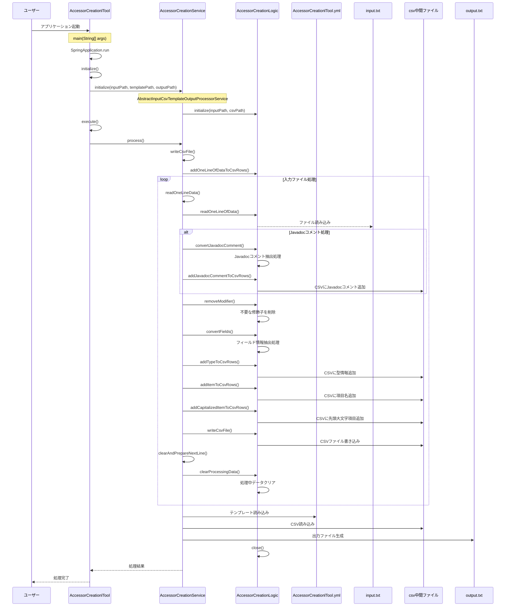

# AccessorCreationlToolシーケンス図

## 概要

このドキュメントは、`AccessorCreationlTool`クラスを起点としたシステムのシーケンス図を提供します。このツールはJavaクラスのフィールドに対するアクセサメソッド（getterおよびsetter）を自動生成するためのツールで、入力ファイルとテンプレートファイルを使用して、アクセサメソッドを含む出力ファイルを生成します。

## シーケンス図

## 処理フロー詳細

1. ユーザーがアプリケーションを起動
2. SpringBootアプリケーションが起動し、AccessorCreationlToolのインスタンスが生成される
3. 初期化処理が実行され、AccessorCreationServiceが初期化される
4. メイン処理が実行され、入力ファイルが読み込まれる
5. フィールド定義からJavadocコメント、型情報、項目名などが抽出される
6. CSV形式に変換され、中間ファイルに書き込まれる
7. テンプレートファイル（AccessorCreationlTool.yml）と中間ファイルを使用して、最終的な出力ファイルが生成される
8. リソースがクローズされ、処理が完了する

## 主要コンポーネント

### AccessorCreationlTool

- SpringBootApplicationとして動作するエントリーポイント
- AbstractDynamicTemplateConversionToolを継承
- AccessorCreationServiceを使用してアクセサ生成を実行

### AccessorCreationService

- Two2OneServiceを実装したサービスインターフェース
- 実装クラス：AccessorCreationServiceImpl
- AbstractInputCsvTemplateOutputProcessorServiceを継承

### AccessorCreationLogic

- アクセサ作成の実際のロジックを担当
- フィールド定義からアクセサメソッドに必要な情報を抽出
- CSV形式の中間ファイルを生成

### テンプレートファイル（AccessorCreationlTool.yml）

- getterとsetterのテンプレートを定義
- 以下のプレースホルダを使用：
  - {name}：フィールドの名称（Javadocコメント）
  - {type}：フィールドの型
  - {item}：フィールド名
  - {Item}：先頭大文字のフィールド名
