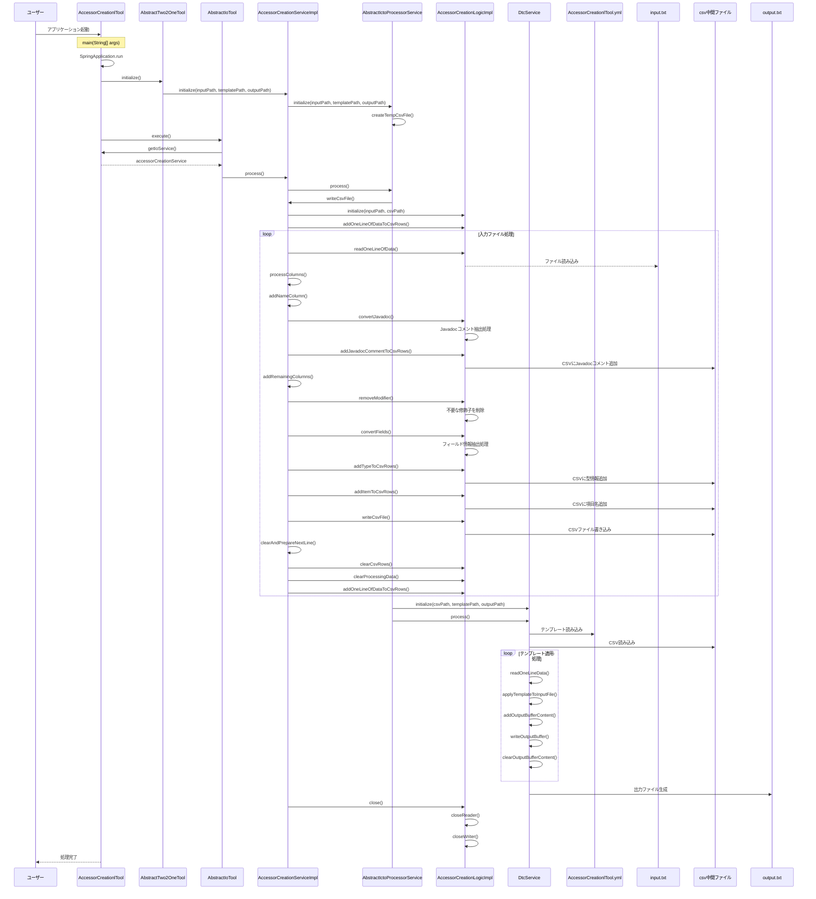

# AccessorCreationlToolシーケンス図

## 概要

このドキュメントは、`AbstractTwo2OneTool`クラスを起点としたアクセサ作成ツールのシーケンス図を提供します。このツールはJavaクラスのフィールドに対するアクセサメソッド（getterおよびsetter）を自動生成するためのツールで、入力ファイルとテンプレートファイルを使用して、アクセサメソッドを含む出力ファイルを生成します。

## シーケンス図

## 処理フロー詳細

1. ユーザーがアプリケーションを起動
2. SpringBootアプリケーションが起動し、AccessorCreationlToolのインスタンスが生成される
3. AbstractTwo2OneToolのinitialize()メソッドが呼び出され、AccessorCreationServiceが初期化される
4. AbstractIoToolのexecute()メソッドが呼び出され、メイン処理が実行される
5. AccessorCreationServiceImplのwriteCsvFile()メソッドが実行され、入力ファイルの処理が開始される
6. 入力ファイルから1行ずつデータを読み込み、以下の処理を行う：
   - Javadocコメントの抽出と変換
   - 不要な修飾子（finalやstatic）の削除
   - フィールド定義から型情報と項目名の抽出
   - CSV形式に変換して中間ファイルに書き込み
7. 中間ファイル（CSV）の生成が完了したら、DtcService（テンプレートの動的変換サービス）を使用して：
   - テンプレートファイル（AccessorCreationlTool.yml）を読み込む
   - 中間ファイル（CSV）のデータを読み込む
   - テンプレートにデータを適用して出力ファイルを生成する
8. リソースがクローズされ、処理が完了する

## 主要コンポーネント

### AccessorCreationlTool

- SpringBootApplicationとして動作するエントリーポイント
- AbstractDynamicTemplateConversionToolを継承（さらにAbstractTwo2OneToolを継承）
- AccessorCreationServiceを使用してアクセサ生成を実行

### AbstractTwo2OneTool

- AbstractIoToolを継承
- テンプレートファイルパスの管理と初期化処理を担当

### AccessorCreationServiceImpl

- AbstractIctoProcessorServiceを継承
- AccessorCreationServiceインターフェースを実装
- 入力ファイルの読み込みとCSV形式への変換を担当

### AccessorCreationLogicImpl

- アクセサ作成の実際のロジックを担当
- フィールド定義からアクセサメソッドに必要な情報を抽出
- CSV形式の中間ファイルを生成

### DtcService（テンプレートの動的変換サービス）

- テンプレートファイルとCSVデータを使用して最終的な出力ファイルを生成
- プレースホルダの置換処理を担当

### テンプレートファイル（AccessorCreationlTool.yml）

- getterとsetterのテンプレートを定義
- 以下のプレースホルダを使用：
  - {name}：フィールドの名称（Javadocコメント）
  - {type}：フィールドの型
  - {item}：フィールド名
  - {Item}：先頭大文字のフィールド名
