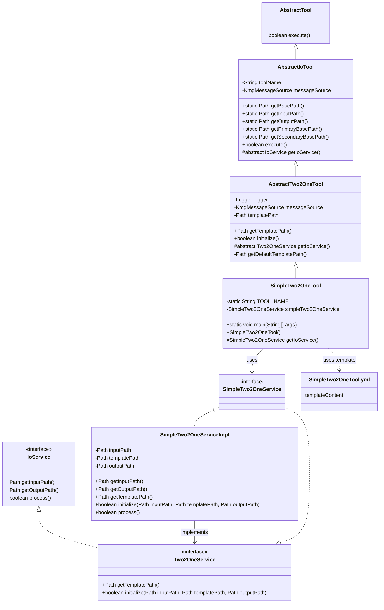
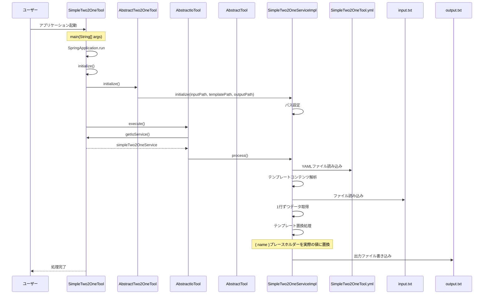

# 2 入力 1 出力変換ツールの設計図

## 1. クラス図

## 2. シーケンス図

## 3. テンプレートファイル構造

SimpleTwo2OneTool.yml は以下の構造を持っています：

1. **templateContent**: テンプレートの内容
   - プレースホルダー（例：`{ name }`）が実際の値に置換される
   - 入力ファイルの各行に対してテンプレートが適用される

## 4. 処理フロー詳細

1. ユーザーがアプリケーションを起動
2. SpringBoot アプリケーションが起動し、SimpleTwo2OneTool のインスタンスが生成される
3. AbstractTwo2OneTool の initialize()メソッドが呼び出され、SimpleTwo2OneService が初期化される
4. AbstractIoTool の execute()メソッドが呼び出され、メイン処理が実行される
5. SimpleTwo2OneServiceImpl の process()メソッドが実行され、以下の処理が開始される：
   - テンプレートファイルの読み込み（YAML 形式の解析）
   - 入力ファイルから 1 行ずつデータを読み込み、以下の処理を行う：
     - テンプレートのプレースホルダー（`{ name }`）を実際の値に置換
     - 置換されたテンプレートを出力ファイルに書き込み
6. 処理が完了する

## 5. 主要コンポーネント

### SimpleTwo2OneTool

- SpringBootApplication として動作するエントリーポイント
- AbstractTwo2OneTool を継承（さらに AbstractIoTool を継承）
- SimpleTwo2OneService を使用して 2 入力 1 出力の変換を実行

### AbstractTwo2OneTool

- AbstractIoTool を継承
- 2 入力 1 出力変換ツールの抽象クラス
- テンプレートファイルパスの管理と初期化処理を担当
- Two2OneService を返す抽象メソッドを定義

### AbstractIoTool

- AbstractTool を継承
- 入出力処理の基本機能を提供
- 入力ファイルと出力ファイルのパス管理
- IoService を使用した処理実行

### SimpleTwo2OneServiceImpl

- SimpleTwo2OneService インターフェースを実装
- 2 入力 1 出力変換の実際のロジックを担当
- YAML 形式のテンプレート定義ファイルの解析
- テンプレートのプレースホルダー置換処理
- 入力ファイルの読み込みと出力ファイルの生成

### テンプレートファイル（SimpleTwo2OneTool.yml）

- YAML フォーマットで定義されたテンプレート設定ファイル
- `templateContent`セクションで構成：
  - 実際のテンプレート内容を定義
  - プレースホルダー（例：`{ name }`）を使用して動的なコンテンツを生成
  - 各プレースホルダーが実際の値に置換される

#### templateContent

- 最終的な出力テンプレートを定義
- プレースホルダー（例：`{ name }`）を使用して、動的なコンテンツを生成
- 入力ファイルの各行に対してテンプレートが適用される
- 各プレースホルダーが実際の値に置換される

## 6. パッケージ構成

### プレゼンテーション層

- `kmg.tool.two2one.presentation.ui.cli.AbstractTwo2OneTool`
- `kmg.tool.simple.presentation.ui.cli.SimpleTwo2OneTool`

### ドメイン層

- `kmg.tool.two2one.domain.service.Two2OneService`
- `kmg.tool.simple.application.service.SimpleTwo2OneService`

### アプリケーション層

- `kmg.tool.two2one.application.types.ConvertEnumDefinitionTypes`
- `kmg.tool.two2one.application.types.MessageTypesRegexGroupTypes`

### インフラストラクチャ層

- `kmg.tool.simple.domain.service.impl.SimpleTwo2OneServiceImpl`

## 7. 設計の特徴

1. **レイヤードアーキテクチャ**: プレゼンテーション層、ドメイン層、アプリケーション層、インフラストラクチャ層に分離
2. **テンプレート駆動**: YAML 形式のテンプレートファイルを使用した動的なコンテンツ生成
3. **Spring Boot 統合**: Spring Boot アプリケーションとして動作し、依存性注入を活用
4. **抽象化**: AbstractTwo2OneTool による共通処理の抽象化
5. **拡張性**: 新しい 2 入力 1 出力ツールの追加が容易
