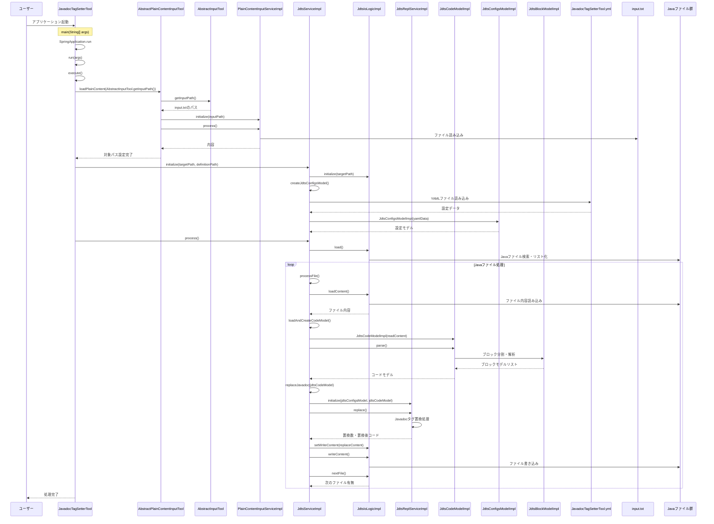

# Javadoc タグ設定ツール設計書

## 1. クラス図

```mermaid
classDiagram
    %% 継承関係
    AbstractTool <|-- AbstractInputTool
    AbstractInputTool <|-- AbstractPlainContentInputTool
    AbstractPlainContentInputTool <|-- JavadocTagSetterTool

    %% インターフェース実装関係
    InputService <|.. PlainContentInputServic
    JdtsService <|.. JdtsServiceImpl
    JdtsIoLogic <|.. JdtsIoLogicImpl
    JdtsReplService <|.. JdtsReplServiceImpl
    JdtsCodeModel <|.. JdtsCodeModelImpl
    JdtsConfigsModel <|.. JdtsConfigsModelImpl
    JdtsBlockModel <|.. JdtsBlockModelImpl

    %% サービス実装関係
    AbstractInputService ..|> InputService
    PlainContentInputServiceImpl --|> AbstractInputService
    PlainContentInputServiceImpl ..|> PlainContentInputServic

    %% ロジック関係
    JavadocTagSetterTool --> PlainContentInputServic : uses
    JavadocTagSetterTool --> JdtsService : uses
    JdtsServiceImpl --> JdtsIoLogic : uses
    JdtsServiceImpl --> JdtsReplService : uses
    JdtsServiceImpl --> JdtsConfigsModel : uses
    JdtsServiceImpl --> JdtsCodeModel : uses
    JdtsReplService --> JdtsConfigsModel : uses
    JdtsReplService --> JdtsCodeModel : uses
    JdtsCodeModel --> JdtsBlockModel : uses

    %% テンプレート関連
    JavadocTagSetterTool ..> JavadocTagSetterTool.yml : uses template

    class AbstractTool {
        +boolean execute()
    }

    class AbstractInputTool {
        -static Path PRIMARY_BASE_PATH
        -static Path SECONDARY_BASE_PATH
        -static Path INPUT_FILE_NAME
        +static Path getBasePath()
        +static Path getInputPath()
        +static Path getPrimaryBasePath()
        +static Path getSecondaryBasePath()
        +abstract InputService getInputService()
    }

    class AbstractPlainContentInputTool {
        -String content
        +String getContent()
        +abstract PlainContentInputServic getInputService()
        +boolean loadPlainContent(Path inputPath)
    }

    class JavadocTagSetterTool {
        -static String TOOL_NAME
        -KmgMessageSource messageSource
        -PlainContentInputServic inputService
        -JdtsService jdtsService
        -Path targetPath
        -Path definitionPath
        +static void main(String[] args)
        +JavadocTagSetterTool()
        +boolean execute()
        +Path getDefinitionPath()
        +PlainContentInputServic getInputService()
        +void run(String[] args)
        -Path getDefaultDefinitionPath()
        -boolean setTargetPathFromInputFile()
    }

    class InputService {
        <<interface>>
        +String getContent()
        +boolean initialize(Path inputPath)
        +boolean process()
    }

    class PlainContentInputServic {
        <<interface>>
    }

    class PlainContentInputServiceImpl {
        -Path inputPath
        -String content
        +String getContent()
        +boolean initialize(Path inputPath)
        +boolean process()
    }

    class JdtsService {
        <<interface>>
        +Path getDefinitionPath()
        +Path getTargetPath()
        +boolean initialize(Path targetPath, Path templatePath)
        +boolean process()
    }

    class JdtsServiceImpl {
        -Logger logger
        -KmgMessageSource messageSource
        -JdtsConfigsModel jdtsConfigsModel
        -JdtsIoLogic jdtsIoLogic
        -JdtsReplService jdtsReplService
        -ApplicationContext applicationContext
        -Path targetPath
        -Path definitionPath
        +JdtsServiceImpl()
        +Path getDefinitionPath()
        +Path getTargetPath()
        +boolean initialize(Path targetPath, Path definitionPath)
        +boolean process()
        -boolean createJdtsConfigsModel()
        -JdtsCodeModel loadAndCreateCodeModel()
        -void logFileEnd()
        -void logFileStart()
        -long processFile()
        -long replaceJavadoc(JdtsCodeModel jdtsCodeModel)
    }

    class JdtsIoLogic {
        <<interface>>
        +Path getCurrentFilePath()
        +List~Path~ getFilePathList()
        +String getReadContent()
        +Path getTargetPath()
        +boolean initialize(Path targetPath)
        +boolean load()
        +boolean loadContent()
        +boolean nextFile()
        +boolean resetFileIndex()
        +void setWriteContent(String content)
        +boolean writeContent()
    }

    class JdtsIoLogicImpl {
        -static String TARGET_FILE_EXTENSION
        -Path targetPath
        -List~Path~ filePathList
        -int currentFileIndex
        -Path currentFilePath
        -String readContent
        -String writeContent
        +JdtsIoLogicImpl()
        +Path getCurrentFilePath()
        +List~Path~ getFilePathList()
        +String getReadContent()
        +Path getTargetPath()
        +boolean initialize(Path targetPath)
        +boolean load()
        +boolean loadContent()
        +boolean nextFile()
        +boolean resetFileIndex()
        +void setWriteContent(String content)
        +boolean writeContent()
    }

    class JdtsReplService {
        <<interface>>
        +JdtsConfigsModel getJdtsConfigsModel()
        +String getReplaceCode()
        +long getTotalReplaceCount()
        +boolean initialize(JdtsConfigsModel jdtsConfigsModel, JdtsCodeModel jdtsCodeModel)
        +boolean replace()
    }

    class JdtsReplServiceImpl {
        -JdtsConfigsModel jdtsConfigsModel
        -JdtsCodeModel jdtsCodeModel
        -String replaceCode
        -long totalReplaceCount
        +JdtsConfigsModel getJdtsConfigsModel()
        +String getReplaceCode()
        +long getTotalReplaceCount()
        +boolean initialize(JdtsConfigsModel jdtsConfigsModel, JdtsCodeModel jdtsCodeModel)
        +boolean replace()
    }

    class JdtsCodeModel {
        <<interface>>
        +String getCode()
        +List~JdtsBlockModel~ getBlockModels()
        +boolean parse()
    }

    class JdtsCodeModelImpl {
        -String code
        -List~JdtsBlockModel~ blockModels
        +JdtsCodeModelImpl(String code)
        +String getCode()
        +List~JdtsBlockModel~ getBlockModels()
        +boolean parse()
    }

    class JdtsConfigsModel {
        <<interface>>
        +List~JdtsConfig~ getConfigs()
    }

    class JdtsConfigsModelImpl {
        -List~JdtsConfig~ configs
        +JdtsConfigsModelImpl(Map~String, Object~ yamlData)
        +List~JdtsConfig~ getConfigs()
    }

    class JdtsBlockModel {
        <<interface>>
        +String getBlockContent()
        +JavaClassificationTypes getClassificationType()
        +List~JavadocModel~ getJavadocModels()
    }

    class JdtsBlockModelImpl {
        -String blockContent
        -JavaClassificationTypes classificationType
        -List~JavadocModel~ javadocModels
        +JdtsBlockModelImpl(String blockContent)
        +String getBlockContent()
        +JavaClassificationTypes getClassificationType()
        +List~JavadocModel~ getJavadocModels()
    }

    class JavadocTagSetterTool.yml {
        JdtsConfigs
        tagName
        tagValue
        location
        insertPosition
        overwrite
    }
```



## 2. シーケンス図



## 3. テンプレートファイル構造

JavadocTagSetterTool.yml は以下の構造を持っています：

1. **JdtsConfigs**: Javadoc タグ設定の配列

   - tagName: タグ名（@は不要）
   - tagValue: タグの値
   - location: 配置設定
     - mode: 配置方法（compliant: 準拠モード、manual: 手動モード）
     - removeIfMisplaced: 指定外の場所にあるタグを削除するかどうか
   - insertPosition: 挿入位置（beginning: 先頭、end: 末尾、preserve: 維持）
   - overwrite: 上書き設定（never: 上書きしない、always: 常に上書き、ifLower: 条件付き上書き）

## 4. 処理フロー詳細

1. ユーザーがアプリケーションを起動
2. SpringBoot アプリケーションが起動し、JavadocTagSetterTool のインスタンスが生成される
3. AbstractPlainContentInputTool の loadPlainContent()メソッドが呼び出され、入力ファイルから対象パスを読み込む
4. JdtsService の initialize()メソッドが呼び出され、対象パスと定義ファイルパスが設定される
5. JdtsServiceImpl の process()メソッドが実行され、メイン処理が開始される
6. 設定ファイル（JavadocTagSetterTool.yml）を読み込み、JdtsConfigsModel を作成する
7. 対象ディレクトリから Java ファイルを検索し、ファイルリストを作成する
8. 各 Java ファイルに対して以下の処理を行う：
   - ファイル内容を読み込む
   - JdtsCodeModel を作成し、コードを解析してブロックに分割する
   - 各ブロックの分類（クラス、インターフェース、メソッドなど）を判定する
   - Javadoc ブロックを抽出し、JavadocModel を作成する
   - 設定に基づいて Javadoc タグを置換する
   - 置換後のコードをファイルに書き込む
9. 全てのファイルの処理が完了したら、処理結果をログに出力し、処理が完了する

## 5. 主要コンポーネント

### JavadocTagSetterTool

- SpringBootApplication として動作するエントリーポイント
- AbstractPlainContentInputTool を継承
- PlainContentInputServic を使用して入力ファイルから対象パスを取得
- JdtsService を使用して Javadoc タグ設定を実行

### AbstractPlainContentInputTool

- AbstractInputTool を継承
- プレーンコンテンツ（テキスト）の入力処理を担当
- 入力ファイルから内容を読み込み、content プロパティに格納

### AbstractInputTool

- AbstractTool を継承
- 入力ファイルパスの管理を担当
- 優先パス（work/io/input.txt）と代替パス（src/main/resources/tool/io/input.txt）を管理

### JdtsServiceImpl

- JdtsService インターフェースを実装
- Javadoc タグ設定のメイン処理を担当
- 設定ファイルの読み込み、Java ファイルの処理、Javadoc タグの置換を統括

### JdtsIoLogicImpl

- JdtsIoLogic インターフェースを実装
- Java ファイルの入出力処理を担当
- 対象ディレクトリから Java ファイルを検索し、ファイルの読み書きを実行

### JdtsReplServiceImpl

- JdtsReplService インターフェースを実装
- Javadoc タグの置換処理を担当
- 設定に基づいて Javadoc タグを追加、更新、削除する

### JdtsCodeModelImpl

- JdtsCodeModel インターフェースを実装
- Java コードの解析とブロック分割を担当
- コードを意味のあるブロック（クラス、メソッド、フィールドなど）に分割する

### JdtsConfigsModelImpl

- JdtsConfigsModel インターフェースを実装
- 設定ファイル（YAML）の解析と管理を担当
- Javadoc タグの設定情報を保持し、置換処理で使用する

### JdtsBlockModelImpl

- JdtsBlockModel インターフェースを実装
- 個別のコードブロックの解析を担当
- ブロックの分類（クラス、インターフェース、メソッドなど）と Javadoc の抽出を行う

### テンプレートファイル（JavadocTagSetterTool.yml）

- YAML フォーマットで定義された設定ファイル
- Javadoc タグの設定情報を定義：
  - タグ名と値
  - 配置方法（準拠モード/手動モード）
  - 挿入位置
  - 上書き設定

#### 設定例

```yaml
JdtsConfigs:
  - tagName: "author"
    tagValue: "KenichiroArai"
    location:
      mode: "compliant"
      removeIfMisplaced: true
    insertPosition: "beginning"
    overwrite: "always"

  - tagName: "since"
    tagValue: "0.1.0"
    location:
      mode: "compliant"
      removeIfMisplaced: true
    insertPosition: "beginning"
    overwrite: "always"
```

## 6. 特徴

- **柔軟な設定**: YAML ファイルによる設定で、様々な Javadoc タグの設定が可能
- **準拠モード**: Java の標準的な Javadoc 配置ルールに従った自動配置
- **手動モード**: 特定の要素（クラス、メソッドなど）に対してのみタグを設定
- **上書き制御**: 既存のタグに対する上書き動作を細かく制御
- **バッチ処理**: 複数の Java ファイルを一括処理
- **ログ出力**: 処理状況と結果を詳細にログ出力
