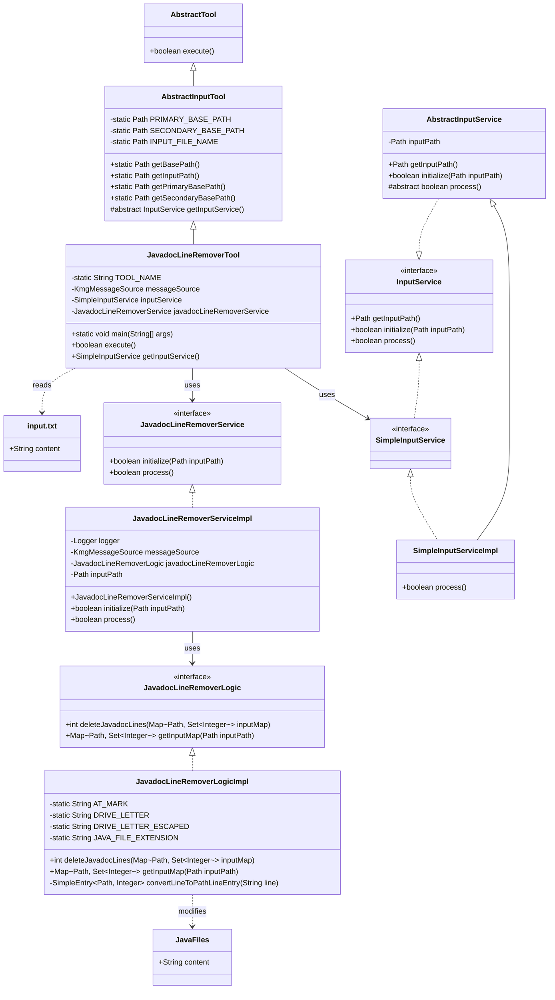
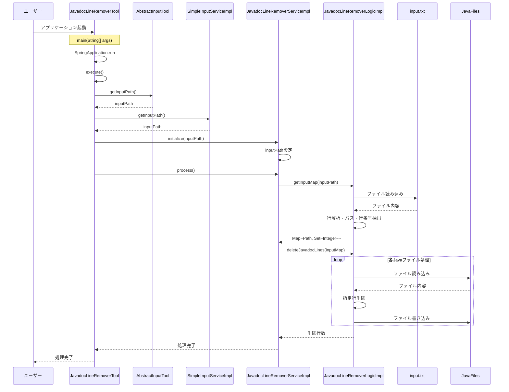

# Javadoc 行削除ツール設計書

## 1. クラス図



## 2. シーケンス図



## 3. 処理フロー詳細

1. **ユーザーがアプリケーションを起動**

   - `JavadocLineRemoverTool.main()`メソッドが呼び出される
   - SpringBoot アプリケーションが起動し、`JavadocLineRemoverTool`のインスタンスが生成される

2. **入力ファイルパスの取得**

   - `AbstractInputTool.getInputPath()`メソッドが呼び出される
   - 優先順位に従って入力ファイルパスを決定：
     1. `work/io/input.txt`（存在する場合）
     2. `src/main/resources/tool/io/input.txt`（代替）

3. **サービスの初期化**

   - `JavadocLineRemoverService.initialize(inputPath)`が呼び出される
   - 入力ファイルパスが設定される

4. **メイン処理の実行**

   - `JavadocLineRemoverService.process()`が呼び出される
   - `JavadocLineRemoverLogic.getInputMap(inputPath)`で入力ファイルを解析
   - 入力ファイルから Java ファイルのパスと行番号のマップを生成

5. **Javadoc 行の削除**

   - `JavadocLineRemoverLogic.deleteJavadocLines(inputMap)`が呼び出される
   - 各 Java ファイルに対して：
     - ファイル内容を読み込み
     - 指定された行番号の行を削除（降順で処理）
     - 変更された内容をファイルに書き戻し

6. **処理完了**
   - 削除された行数がログに出力される
   - 処理が完了する

## 4. 主要コンポーネント

### JavadocLineRemoverTool

- **役割**: SpringBootApplication として動作するエントリーポイント
- **継承**: `AbstractInputTool`を継承
- **機能**:
  - 入力ファイルパスの取得
  - サービスの初期化と実行
  - エラーハンドリングとログ出力

### AbstractInputTool

- **役割**: 入力処理ツールの抽象基底クラス
- **機能**:
  - 入力ファイルパスの管理（優先順位付き）
  - 基準パスの提供
  - 入力サービスの抽象メソッド定義

### JavadocLineRemoverServiceImpl

- **役割**: Javadoc 行削除のサービス層実装
- **機能**:
  - 入力ファイルパスの管理
  - ロジック層への処理委譲
  - ログ出力

### JavadocLineRemoverLogicImpl

- **役割**: Javadoc 行削除の実際のロジック実装
- **機能**:
  - 入力ファイルの解析（パスと行番号の抽出）
  - Java ファイルからの行削除処理
  - ファイルの読み書き

### SimpleInputServiceImpl

- **役割**: シンプルな入力サービスの実装
- **機能**: 基本的な入力処理（このツールでは特別な処理は行わない）

## 5. 入力ファイル形式

### input.txt

入力ファイルは以下の形式で記述されます：

```text
D:\path\to\file1.java:123
D:\path\to\file2.java:456
D:\path\to\file3.java:789
```

- 各行は「ファイルパス:行番号」の形式
- ファイルパスは絶対パスで記述
- 行番号は 1 から始まる
- `.java:`を含む行のみが処理対象

## 6. 処理の特徴

### 行削除の順序

- 行番号は降順でソートされてから削除される
- これにより、行を削除しても後続の行番号に影響を与えない

### エラーハンドリング

- ファイルの読み書きエラーは`KmgToolMsgException`として適切に処理される
- 存在しないファイルや無効な行番号はスキップされる

### ログ出力

- 削除された行数がデバッグログに出力される
- 処理の成功・失敗が適切にログに記録される

## 7. 設定とカスタマイズ

### ファイルパス設定

- 入力ファイルの場所は`AbstractInputTool`で管理
- 環境に応じて`work/io`または`src/main/resources/tool/io`を使用

### 定数設定

- `JavadocLineRemoverLogicImpl`内で以下の定数が定義：
  - `AT_MARK`: "@"文字
  - `DRIVE_LETTER`: ドライブ文字（"D:"）
  - `JAVA_FILE_EXTENSION`: Java ファイル拡張子（".java:"）

これらの定数を変更することで、異なる環境や要件に対応可能です。
