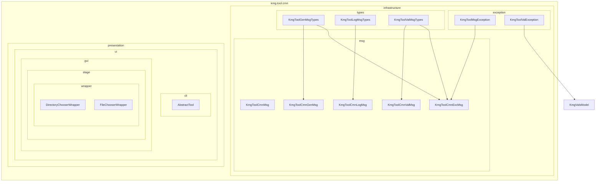
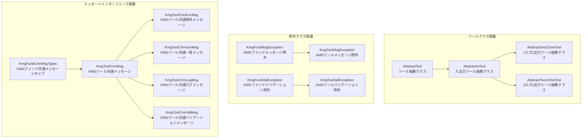

# cmn パッケージ設計書

## 1. クラス図

```mermaid
classDiagram
    %% 継承関係
    AbstractTool <|-- AbstractIoTool
    AbstractIoTool <|-- AbstractOne2OneTool
    AbstractIoTool <|-- AbstractTwo2OneTool

    %% 例外クラス継承関係
    KmgFundMsgException <|-- KmgToolMsgException
    KmgFundValException <|-- KmgToolValException

    %% メッセージインターフェース継承関係
    KmgFundCmnMsgTypes <|-- KmgToolCmnMsg
    KmgToolCmnMsg <|-- KmgToolCmnExcMsg
    KmgToolCmnMsg <|-- KmgToolCmnGenMsg
    KmgToolCmnMsg <|-- KmgToolCmnLogMsg
    KmgToolCmnMsg <|-- KmgToolCmnValMsg

    %% メッセージタイプ実装関係
    KmgToolCmnGenMsg <|.. KmgToolGenMsgTypes
    KmgToolCmnExcMsg <|.. KmgToolGenMsgTypes
    KmgToolCmnLogMsg <|.. KmgToolLogMsgTypes
    KmgToolCmnValMsg <|.. KmgToolValMsgTypes
    KmgToolCmnExcMsg <|.. KmgToolValMsgTypes

    %% ラッパークラス
    DirectoryChooserWrapper --> DirectoryChooser : wraps
    FileChooserWrapper --> FileChooser : wraps

    %% 例外関係
    KmgToolMsgException --> KmgToolCmnExcMsg : uses
    KmgToolValException --> KmgValsModel : uses

    class AbstractTool {
        <<abstract>>
        +boolean execute()
    }

    class AbstractIoTool {
        <<abstract>>
        -String toolName
        -KmgMessageSource messageSource
        +static Path getBasePath()
        +static Path getInputPath()
        +static Path getOutputPath()
        +static Path getPrimaryBasePath()
        +static Path getSecondaryBasePath()
        +boolean execute()
        #abstract IoService getIoService()
    }

    class AbstractOne2OneTool {
        <<abstract>>
        -Logger logger
        -KmgMessageSource messageSource
        +AbstractOne2OneTool(String toolName)
        +boolean initialize()
        #abstract One2OneService getIoService()
    }

    class AbstractTwo2OneTool {
        <<abstract>>
        -Logger logger
        -KmgMessageSource messageSource
        -Path templatePath
        +AbstractTwo2OneTool(String toolName)
        +Path getTemplatePath()
        +boolean initialize()
        #abstract Two2OneService getIoService()
    }

    class KmgToolMsgException {
        -KmgMessageSource messageSource
        +KmgToolMsgException(KmgToolCmnExcMsg messageTypes)
        +KmgToolMsgException(KmgToolCmnExcMsg messageTypes, Object[] messageArgs)
        +KmgToolMsgException(KmgToolCmnExcMsg messageTypes, Object[] messageArgs, Throwable cause)
        +KmgToolMsgException(KmgToolCmnExcMsg messageTypes, Throwable cause)
        #String createMessage()
        #void createMessageSource()
    }

    class KmgToolValException {
        +KmgToolValException(KmgValsModel validationsModel)
        +KmgToolValException(KmgValsModel validationsModel, Throwable cause)
    }

    class KmgToolCmnMsg {
        <<interface>>
    }

    class KmgToolCmnExcMsg {
        <<interface>>
    }

    class KmgToolCmnGenMsg {
        <<interface>>
    }

    class KmgToolCmnLogMsg {
        <<interface>>
    }

    class KmgToolCmnValMsg {
        <<interface>>
    }

    class KmgToolGenMsgTypes {
        <<enumeration>>
        +NONE
        +KMGTOOL_GEN01000
        +KMGTOOL_GEN01001
        +KMGTOOL_GEN01002
        +KMGTOOL_GEN03000
        +KMGTOOL_GEN03001
        +KMGTOOL_GEN09000
        +KMGTOOL_GEN09001
        +KMGTOOL_GEN09002
        +static KmgToolGenMsgTypes getDefault()
        +static KmgToolGenMsgTypes getEnum(String key)
        +String get()
        +String getCode()
        +String getDetail()
        +String getDisplayName()
        +String getKey()
        +String getValue()
    }

    class KmgToolLogMsgTypes {
        <<enumeration>>
        +NONE
        +KMGTOOL_LOG01000
        +KMGTOOL_LOG01001
        +KMGTOOL_LOG03000
        +KMGTOOL_LOG03001
        +KMGTOOL_LOG13005
        +KMGTOOL_LOG13006
        +static KmgToolLogMsgTypes getDefault()
        +static KmgToolLogMsgTypes getEnum(String key)
        +String get()
        +String getCode()
        +String getDetail()
        +String getDisplayName()
        +String getKey()
        +String getValue()
    }

    class KmgToolValMsgTypes {
        <<enumeration>>
        +NONE
        +KMGTOOL_VAL13000
        +KMGTOOL_VAL13001
        +KMGTOOL_VAL13002
        +KMGTOOL_VAL13010
        +static KmgToolValMsgTypes getDefault()
        +static KmgToolValMsgTypes getEnum(String key)
        +String get()
        +String getCode()
        +String getDetail()
        +String getDisplayName()
        +String getKey()
        +String getValue()
    }

    class DirectoryChooserWrapper {
        -DirectoryChooser directoryChooser
        +DirectoryChooserWrapper()
        +void setInitialDirectory(File initialDirectory)
        +void setTitle(String title)
        +File showDialog(Window ownerWindow)
    }

    class FileChooserWrapper {
        -FileChooser fileChooser
        +FileChooserWrapper()
        +void setInitialDirectory(File initialDirectory)
        +void setTitle(String title)
        +File showOpenDialog(Window ownerWindow)
    }
```



## 2. パッケージ構成図



## 3. 継承階層図



## 4. 処理フロー詳細

### 4.1 ツール実行フロー

1. **ツール起動**: 各ツールクラスが `AbstractTool.execute()` メソッドを呼び出し
2. **初期化**: `AbstractIoTool.execute()` でパフォーマンス測定開始とログ設定
3. **サービス実行**: 各ツールが実装する `getIoService().process()` を実行
4. **結果処理**: 成功時は成功メッセージ、失敗時は失敗メッセージをログ出力
5. **リソース解放**: パフォーマンス測定終了とリソースクリーンアップ

### 4.2 例外処理フロー

1. **例外発生**: 各ツール処理中に `KmgToolMsgException` または `KmgToolValException` が発生
2. **メッセージ生成**: 例外クラスが `KmgMessageSource` を使用してメッセージを生成
3. **ログ出力**: 適切なログレベルでエラーメッセージを出力
4. **処理継続**: 例外がキャッチされ、適切なエラーハンドリングを実行

### 4.3 メッセージ管理フロー

1. **メッセージタイプ定義**: `KmgToolGenMsgTypes`、`KmgToolLogMsgTypes`、`KmgToolValMsgTypes` でメッセージを定義
2. **メッセージ取得**: `KmgMessageSource` を使用して国際化対応メッセージを取得
3. **メッセージ表示**: 各コンポーネントで適切なメッセージを表示

## 5. 主要コンポーネント

### AbstractTool

- 全ツールの基底となる抽象クラス
- `execute()` メソッドを抽象メソッドとして定義
- ツールの実行インターフェースを提供

### AbstractIoTool

- 入出力処理を担当する抽象クラス
- 入力・出力ファイルパスの自動解決機能
- パフォーマンス測定とログ管理機能
- `IoService` を使用した実際の処理実行

### AbstractOne2OneTool

- 1 つの入力ファイルから 1 つの出力ファイルへの変換ツール
- `One2OneService` を使用した処理実行
- 初期化処理とエラーハンドリング機能

### AbstractTwo2OneTool

- 2 つの入力ファイル（入力ファイル＋テンプレートファイル）から 1 つの出力ファイルへの変換ツール
- テンプレートファイルパスの自動解決
- `Two2OneService` を使用した処理実行

### KmgToolMsgException

- KMG ツール専用のメッセージ例外クラス
- `KmgToolCmnExcMsg` を使用したメッセージ管理
- メッセージ引数と原因例外のサポート

### KmgToolValException

- KMG ツール専用のバリデーション例外クラス
- `KmgValsModel` を使用したバリデーション結果管理

### メッセージタイプ列挙型

#### KmgToolGenMsgTypes

- 一般メッセージの種類を定義
- 例外メッセージと一般メッセージの両方のインターフェースを実装
- エラー、成功、情報などの一般的なメッセージを提供

#### KmgToolLogMsgTypes

- ログメッセージの種類を定義
- 処理開始・終了、エラー発生などのログメッセージを提供

#### KmgToolValMsgTypes

- バリデーションメッセージの種類を定義
- バリデーションエラーと例外メッセージの両方のインターフェースを実装
- 入力値検証エラーメッセージを提供

### GUI ラッパークラス

#### DirectoryChooserWrapper

- JavaFX `DirectoryChooser` のラッパークラス
- テスト時のモック化を容易にする
- ディレクトリ選択ダイアログの機能を提供

#### FileChooserWrapper

- JavaFX `FileChooser` のラッパークラス
- テスト時のモック化を容易にする
- ファイル選択ダイアログの機能を提供

## 6. 設計思想

### 6.1 共通化の原則

- 各ツールで共通して使用される機能を `cmn` パッケージに集約
- 抽象クラスによる共通処理の実装と継承による特化処理の実装

### 6.2 例外処理の統一

- ツール専用の例外クラスによる統一された例外処理
- メッセージ国際化対応による多言語サポート

### 6.3 テスタビリティ

- ラッパークラスによる外部依存の分離
- モック化しやすい設計による単体テストの容易性

### 6.4 拡張性

- インターフェースベースの設計による機能拡張の容易性
- 抽象クラスによる新機能追加時の影響範囲の限定

## 7. 使用例

### 7.1 基本的なツール実装

```java
public class CustomTool extends AbstractIoTool {
    private final CustomService customService;

    public CustomTool(String toolName, CustomService customService) {
        super(toolName);
        this.customService = customService;
    }

    @Override
    protected IoService getIoService() {
        return this.customService;
    }
}
```

### 7.2 例外処理

```java
try {
    // 何らかの処理
} catch (SomeException e) {
    throw new KmgToolMsgException(
        KmgToolGenMsgTypes.KMGTOOL_GEN09002,
        new Object[]{"処理名"},
        e
    );
}
```

### 7.3 GUI コンポーネント使用

```java
DirectoryChooserWrapper chooser = new DirectoryChooserWrapper();
chooser.setTitle("ディレクトリを選択してください");
File selectedDir = chooser.showDialog(stage);
```
