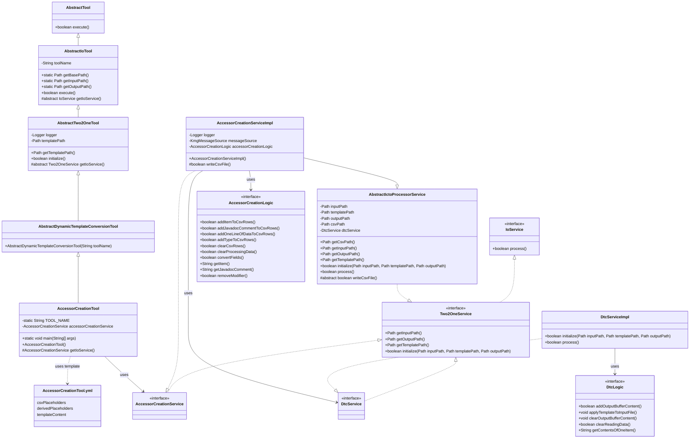
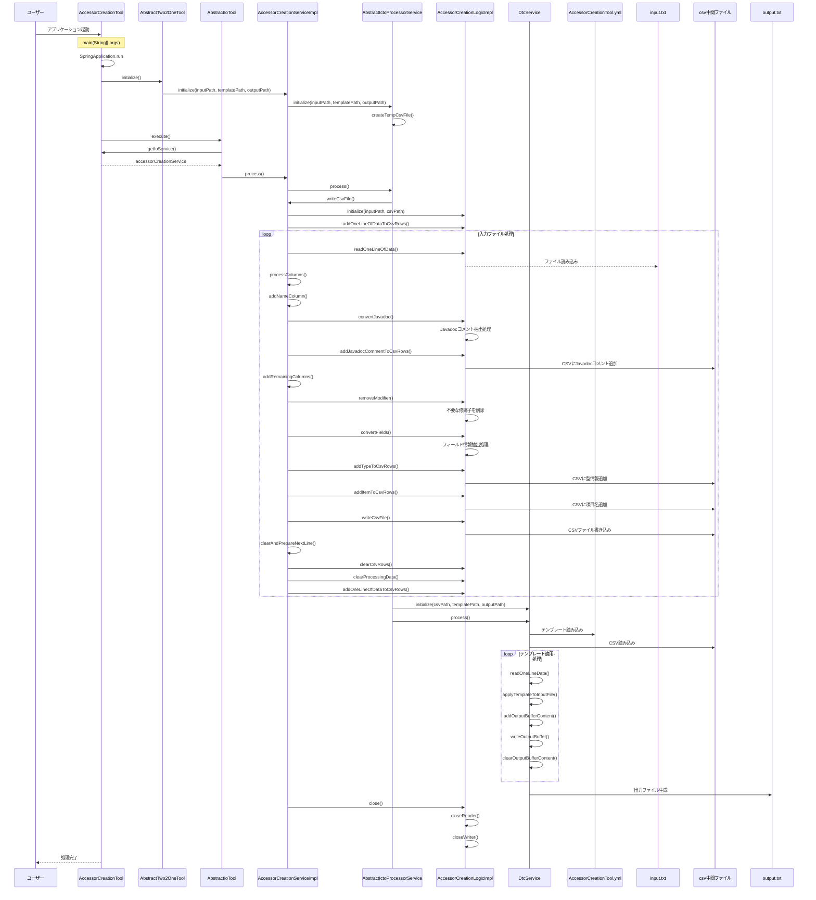

# アクセサ作成ツール設計書

## 1. クラス図

## 2. シーケンス図

## 3. テンプレートファイル構造

AccessorCreationTool.ymlは以下の構造を持っています：

1. **csvPlaceholders**: CSVから直接取得するプレースホルダー定義
   - displayName: 画面表示用の名称
   - replacementPattern: 置換対象のパターン

2. **derivedPlaceholders**: CSVから取得した値を変換して生成するプレースホルダー定義
   - displayName: 画面表示用の名称
   - replacementPattern: 置換対象のパターン
   - sourceKey: 変換元となるCSVプレースホルダーのdisplayName
   - transformation: 適用する変換処理

3. **templateContent**: テンプレートの内容
   - {name}, {type}, {item}, {capitalize}のプレースホルダーが実際の値に置換される

## 4. 処理フロー詳細

1. ユーザーがアプリケーションを起動
2. SpringBootアプリケーションが起動し、AccessorCreationToolのインスタンスが生成される
3. AbstractTwo2OneToolのinitialize()メソッドが呼び出され、AccessorCreationServiceが初期化される
4. AbstractIoToolのexecute()メソッドが呼び出され、メイン処理が実行される
5. AccessorCreationServiceImplのwriteCsvFile()メソッドが実行され、入力ファイルの処理が開始される
6. 入力ファイルから1行ずつデータを読み込み、以下の処理を行う：
   - Javadocコメントの抽出と変換
   - 不要な修飾子（finalやstatic）の削除
   - フィールド定義から型情報と項目名の抽出
   - CSV形式に変換して中間ファイルに書き込み
7. 中間ファイル（CSV）の生成が完了したら、DtcService（テンプレートの動的変換サービス）を使用して：
   - テンプレートファイル（AccessorCreationTool.yml）を読み込む
   - 中間ファイル（CSV）のデータを読み込む
   - テンプレートにデータを適用して出力ファイルを生成する
8. リソースがクローズされ、処理が完了する

## 5. 主要コンポーネント

### AccessorCreationTool

- SpringBootApplicationとして動作するエントリーポイント
- AbstractDynamicTemplateConversionToolを継承（さらにAbstractTwo2OneToolを継承）
- AccessorCreationServiceを使用してアクセサ生成を実行

### AbstractTwo2OneTool

- AbstractIoToolを継承
- テンプレートファイルパスの管理と初期化処理を担当

### AccessorCreationServiceImpl

- AbstractIctoProcessorServiceを継承
- AccessorCreationServiceインターフェースを実装
- 入力ファイルの読み込みとCSV形式への変換を担当

### AccessorCreationLogicImpl

- アクセサ作成の実際のロジックを担当
- フィールド定義からアクセサメソッドに必要な情報を抽出
- CSV形式の中間ファイルを生成

### DtcService（テンプレートの動的変換サービス）

- テンプレートファイルとCSVデータを使用して最終的な出力ファイルを生成
- プレースホルダの置換処理を担当

### テンプレートファイル（AccessorCreationTool.yml）

- YAMLフォーマットで定義されたテンプレート設定ファイル
- 以下の主要セクションで構成：
  - `csvPlaceholders`: CSVから直接取得するプレースホルダー定義
  - `derivedPlaceholders`: CSVから取得した値を変換して生成するプレースホルダー定義
  - `templateContent`: 実際のテンプレート内容

#### csvPlaceholders

- CSVファイルの各列から直接マッピングされるプレースホルダー
  - `{name}`: フィールドの名称（Javadocコメント）
  - `{type}`: フィールドの型
  - `{item}`: フィールド名

#### derivedPlaceholders

- 既存のプレースホルダーから変換して生成される派生プレースホルダー
  - `{capitalize}`: 項目名の先頭を大文字にした値（例: item → Item）
  - 変換元: `項目`（`{item}`）
  - 変換処理: `capitalize`（先頭大文字化）

#### templateContent

- getterとsetterのテンプレートを定義
- 上記のプレースホルダーを使用して、フィールドごとにカスタマイズされたアクセサメソッドを生成
- 各メソッドにはJavadocコメントも含まれる
