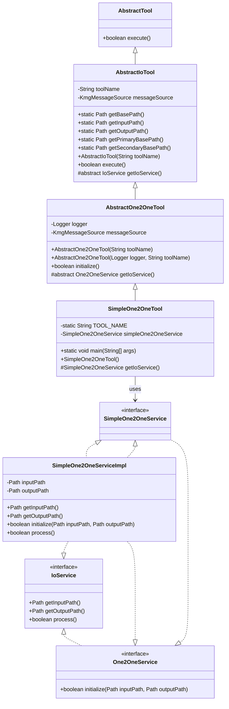
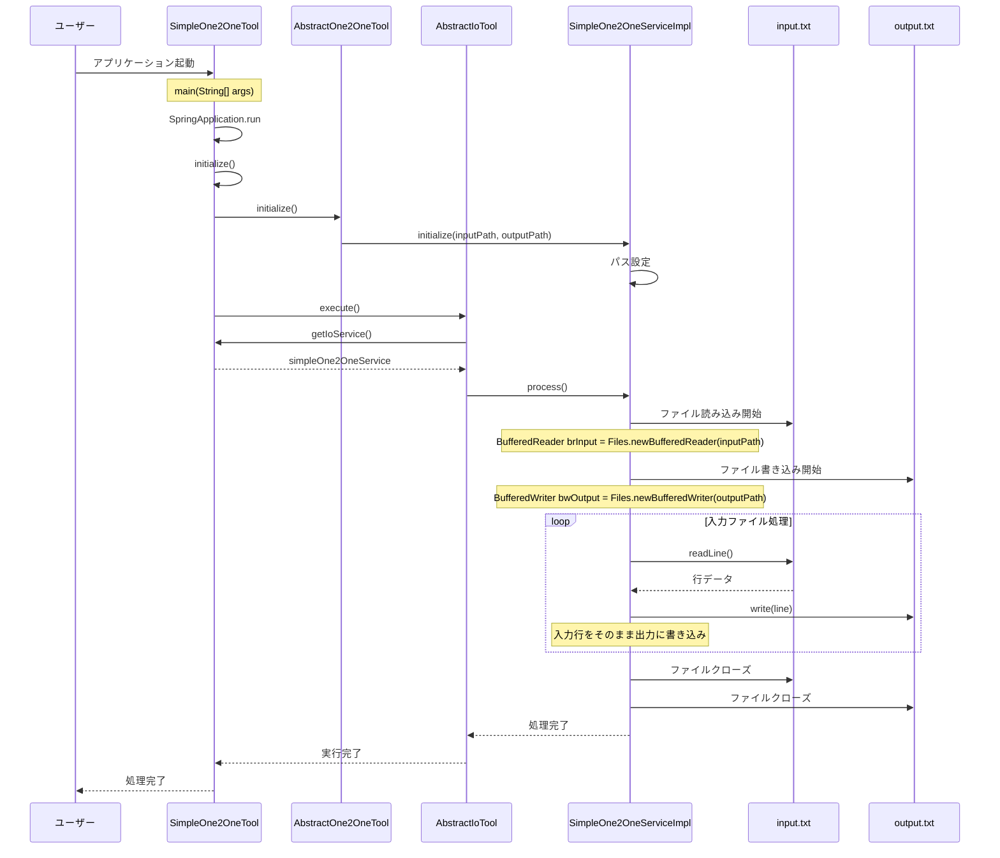

# シンプル 1 入力 1 出力ツール設計書

## 1. クラス図



## 2. シーケンス図



## 3. 処理フロー詳細

1. **アプリケーション起動**

   - ユーザーが SimpleOne2OneTool を起動
   - SpringBoot アプリケーションが起動し、SimpleOne2OneTool のインスタンスが生成される

2. **初期化処理**

   - AbstractOne2OneTool の initialize()メソッドが呼び出される
   - SimpleOne2OneServiceImpl の initialize()メソッドが実行され、入力ファイルパスと出力ファイルパスが設定される

3. **実行処理**

   - AbstractIoTool の execute()メソッドが呼び出される
   - SimpleOne2OneServiceImpl の process()メソッドが実行される

4. **ファイル処理**

   - 入力ファイル（input.txt）を BufferedReader で読み込み開始
   - 出力ファイル（output.txt）を BufferedWriter で書き込み開始
   - 入力ファイルから 1 行ずつデータを読み込み、そのまま出力ファイルに書き込む
   - 入力ファイルの終端まで処理を繰り返す

5. **リソース解放**

   - 入力ファイルと出力ファイルのリーダー・ライターをクローズ
   - 処理結果を返す

6. **終了処理**
   - SpringBoot アプリケーションコンテキストをクローズ
   - アプリケーション終了

## 4. 主要コンポーネント

### SimpleOne2OneTool

- **役割**: SpringBootApplication として動作するエントリーポイント
- **継承関係**: AbstractOne2OneTool を継承（さらに AbstractIoTool を継承）
- **主要機能**:
  - SpringBoot アプリケーションの起動
  - SimpleOne2OneService の依存性注入
  - ツールの初期化と実行の制御

### AbstractOne2OneTool

- **役割**: 1 入力ファイルから 1 出力ファイルへの変換ツールの抽象クラス
- **継承関係**: AbstractIoTool を継承
- **主要機能**:
  - ログ出力とメッセージソースの管理
  - One2OneService の初期化処理
  - エラーハンドリング

### AbstractIoTool

- **役割**: 入出力処理の基本機能を提供する抽象クラス
- **継承関係**: AbstractTool を継承
- **主要機能**:
  - 入力・出力ファイルパスの管理（優先パス: work/io、代替パス: src/main/resources/tool/io）
  - パフォーマンス測定サービスの統合
  - メイン処理の実行制御

### SimpleOne2OneServiceImpl

- **役割**: シンプルな 1 入力 1 出力変換の実際の処理を担当
- **実装関係**: SimpleOne2OneService、One2OneService、IoService を実装
- **主要機能**:
  - 入力・出力ファイルパスの管理
  - ファイルの初期化処理
  - 入力ファイルから出力ファイルへの単純なコピー処理

### ファイルパス管理

- **優先パス**: `work/io/input.txt`、`work/io/output.txt`
- **代替パス**: `src/main/resources/tool/io/input.txt`、`src/main/resources/tool/io/output.txt`
- **動作**: 優先パスにファイルが存在する場合はそちらを使用、存在しない場合は代替パスを使用

## 5. 設計の特徴

### シンプルな設計

- 複雑な変換処理を行わず、入力ファイルの内容をそのまま出力ファイルにコピーする
- テンプレートファイルを使用しない単純な 1 対 1 の変換

### 柔軟なファイルパス管理

- 開発環境（work/io）と本番環境（src/main/resources/tool/io）の両方に対応
- ファイルの存在確認による自動的なパス切り替え

### SpringBoot 統合

- 依存性注入による疎結合な設計
- アノテーションベースの設定管理

### エラーハンドリング

- KmgToolMsgException による統一された例外処理
- ログ出力による処理状況の可視化

### パフォーマンス測定

- KmgPfaMeasService による処理時間の測定
- 処理開始・終了・エラー時のメッセージ出力

## 6. 使用例

### 基本的な使用方法

1. 入力ファイル（input.txt）を準備
2. SimpleOne2OneTool を実行
3. 出力ファイル（output.txt）に結果が生成される

### ファイル配置

```text
work/io/
├── input.txt    # 入力ファイル（優先）
└── output.txt   # 出力ファイル（優先）

または

src/main/resources/tool/io/
├── input.txt    # 入力ファイル（代替）
└── output.txt   # 出力ファイル（代替）
```

### 実行コマンド

```bash
java -jar SimpleOne2OneTool.jar
```

この設計書は、SimpleOne2OneTool の構造と動作を詳細に説明し、アクセサ作成ツールの設計図と同様の形式で整理されています。
