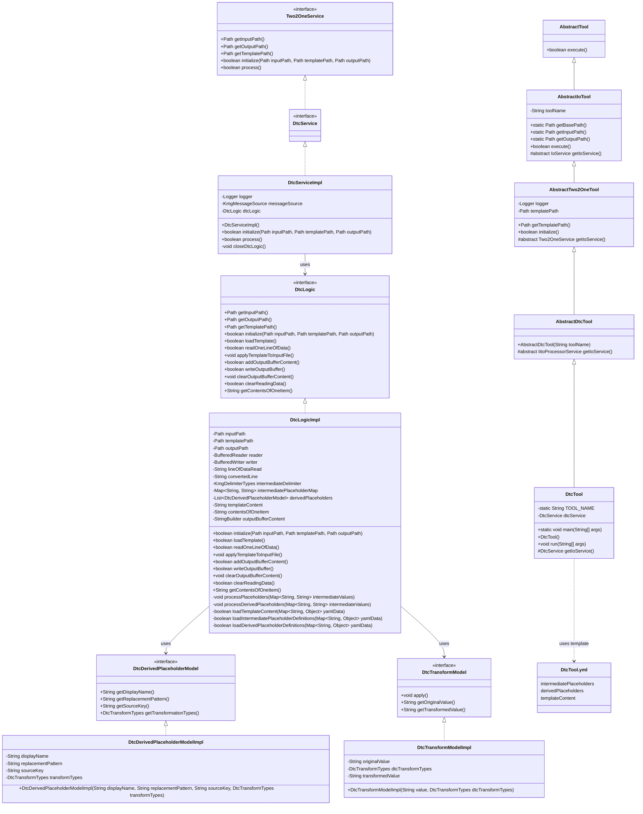
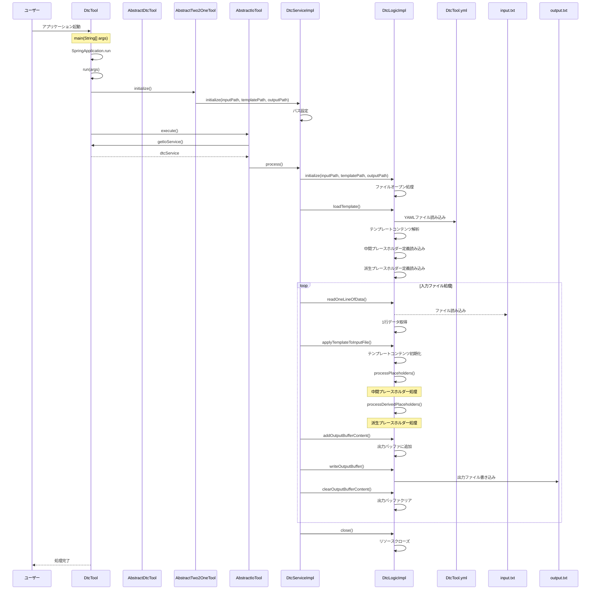

# DTC ツール設計書

## 1. クラス図

## 2. シーケンス図

## 3. テンプレートファイル構造

DtcTool.yml は以下の構造を持っています：

1. **intermediatePlaceholders**: 中間ファイルから直接取得するプレースホルダー定義

   - displayName: 画面表示用の名称
   - replacementPattern: 置換対象のパターン

2. **derivedPlaceholders**: 中間ファイルから取得した値を変換して生成するプレースホルダー定義

   - displayName: 画面表示用の名称
   - replacementPattern: 置換対象のパターン
   - sourceKey: 変換元となる中間プレースホルダーの displayName
   - transformation: 適用する変換処理

3. **templateContent**: テンプレートの内容
   - プレースホルダーが実際の値に置換される

## 4. 処理フロー詳細

1. ユーザーがアプリケーションを起動
2. SpringBoot アプリケーションが起動し、DtcTool のインスタンスが生成される
3. AbstractTwo2OneTool の initialize()メソッドが呼び出され、DtcService が初期化される
4. AbstractIoTool の execute()メソッドが呼び出され、メイン処理が実行される
5. DtcServiceImpl の process()メソッドが実行され、以下の処理が開始される：
   - DtcLogic の初期化（入力ファイル、テンプレートファイル、出力ファイルのオープン）
   - テンプレートファイルの読み込み（YAML 形式の解析）
   - 入力ファイルから 1 行ずつデータを読み込み、以下の処理を行う：
     - 中間プレースホルダーの処理（入力データから直接値を取得）
     - 派生プレースホルダーの処理（変換処理を適用）
     - テンプレートにデータを適用して出力ファイルを生成
6. リソースがクローズされ、処理が完了する

## 5. 主要コンポーネント

### DtcTool

- SpringBootApplication として動作するエントリーポイント
- AbstractDtcTool を継承（さらに AbstractTwo2OneTool を継承）
- DtcService を使用してテンプレートの動的変換を実行

### AbstractDtcTool

- AbstractTwo2OneTool を継承
- テンプレートの動的変換ツールの抽象クラス
- IitoProcessorService を返す抽象メソッドを定義

### AbstractTwo2OneTool

- AbstractIoTool を継承
- テンプレートファイルパスの管理と初期化処理を担当

### DtcServiceImpl

- Two2OneService インターフェースを実装
- DtcLogic を使用してテンプレートの動的変換処理を実行
- 入力ファイルの読み込みと出力ファイルの生成を担当

### DtcLogicImpl

- DtcLogic インターフェースを実装
- テンプレートの動的変換の実際のロジックを担当
- YAML 形式のテンプレート定義ファイルの解析
- 中間プレースホルダーと派生プレースホルダーの処理
- テンプレートへのデータ適用と出力ファイル生成

### DtcDerivedPlaceholderModelImpl

- DtcDerivedPlaceholderModel インターフェースを実装
- 派生プレースホルダーの定義を管理
- 表示名、置換パターン、ソースキー、変換処理の種類を保持

### DtcTransformModelImpl

- DtcTransformModel インターフェースを実装
- 文字列変換処理を実行
- capitalize、toUpperCase、toLowerCase などの変換処理を提供

### テンプレートファイル（DtcTool.yml）

- YAML フォーマットで定義されたテンプレート設定ファイル
- 以下の主要セクションで構成：
  - `intermediatePlaceholders`: 中間ファイルから直接取得するプレースホルダー定義
  - `derivedPlaceholders`: 中間ファイルから取得した値を変換して生成するプレースホルダー定義
  - `templateContent`: 実際のテンプレート内容

#### intermediatePlaceholders

- 入力ファイルの各列から直接マッピングされるプレースホルダー
- 入力データの値をそのままテンプレートに置換

#### derivedPlaceholders

- 既存のプレースホルダーから変換して生成される派生プレースホルダー
- 変換処理（capitalize、toUpperCase、toLowerCase）を適用
- 変換元となるプレースホルダーの値を指定

#### templateContent

- 最終的な出力テンプレートを定義
- 上記のプレースホルダーを使用して、動的なコンテンツを生成
- 各プレースホルダーが実際の値に置換される
