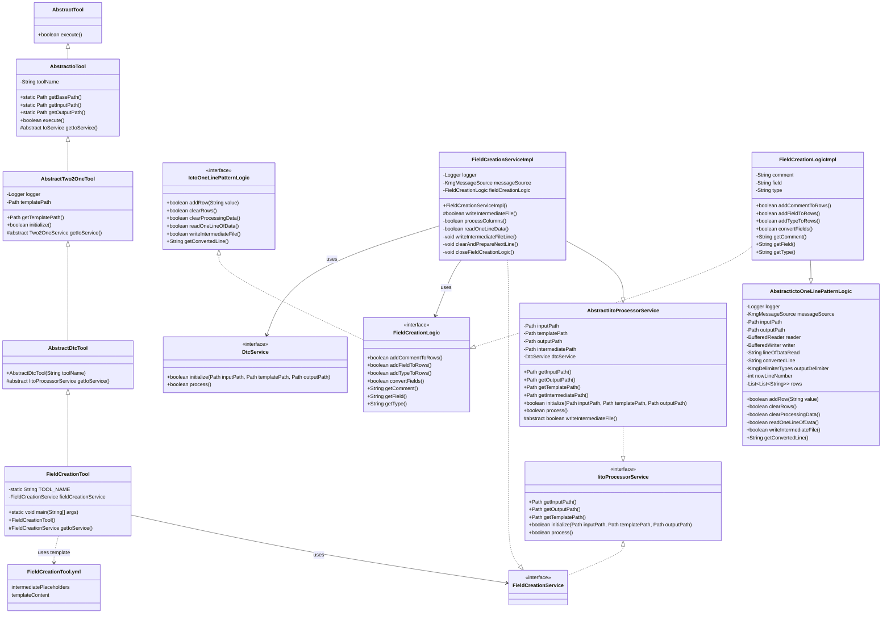
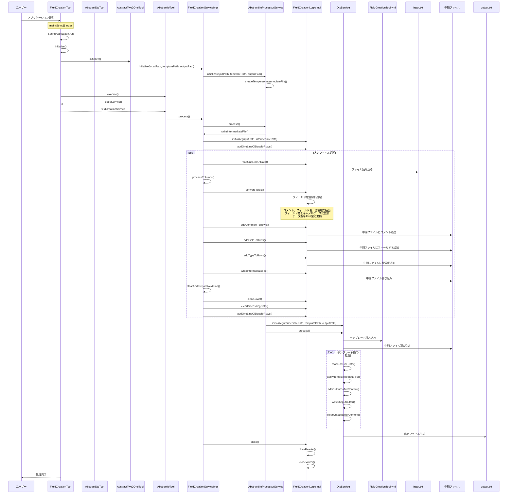

# フィールド作成ツール設計書

## 1. クラス図



## 2. シーケンス図



## 3. テンプレートファイル構造

FieldCreationTool.yml は以下の構造を持っています：

1. **intermediatePlaceholders**: 中間ファイルから直接取得するプレースホルダー定義

   - displayName: 画面表示用の名称
   - replacementPattern: 置換対象のパターン

2. **templateContent**: テンプレートの内容
   - {comment}, {field}, {type}のプレースホルダーが実際の値に置換される

### intermediatePlaceholders

- 中間ファイルの各列から直接マッピングされるプレースホルダー
  - `{comment}`: フィールドのコメント
  - `{field}`: フィールド名（キャメルケース変換済み）
  - `{type}`: フィールドの型（Java 型に変換済み）

### templateContent

- Java フィールド定義のテンプレートを定義
- 上記のプレースホルダーを使用して、フィールドごとにカスタマイズされた Java フィールド定義を生成
- 各フィールドには Javadoc コメントも含まれる

## 4. 処理フロー詳細

1. ユーザーがアプリケーションを起動
2. SpringBoot アプリケーションが起動し、FieldCreationTool のインスタンスが生成される
3. AbstractTwo2OneTool の initialize()メソッドが呼び出され、FieldCreationService が初期化される
4. AbstractIoTool の execute()メソッドが呼び出され、メイン処理が実行される
5. FieldCreationServiceImpl の writeIntermediateFile()メソッドが実行され、入力ファイルの処理が開始される
6. 入力ファイルから 1 行ずつデータを読み込み、以下の処理を行う：
   - フィールド定義の解析（コメント、フィールド名、データ型の抽出）
   - フィールド名のキャメルケース変換
   - データベース型から Java 型への変換
   - 中間ファイル形式に変換して中間ファイルに書き込み
7. 中間ファイルの生成が完了したら、DtcService（テンプレートの動的変換サービス）を使用して：
   - テンプレートファイル（FieldCreationTool.yml）を読み込む
   - 中間ファイルのデータを読み込む
   - テンプレートにデータを適用して出力ファイルを生成する
8. リソースがクローズされ、処理が完了する

## 5. 主要コンポーネント

### FieldCreationTool

- SpringBootApplication として動作するエントリーポイント
- AbstractDtcTool を継承（さらに AbstractTwo2OneTool を継承）
- FieldCreationService を使用してフィールド生成を実行

### AbstractDtcTool

- AbstractTwo2OneTool を継承
- テンプレートの動的変換ツールの抽象クラス
- IitoProcessorService を返す抽象メソッドを定義

### AbstractTwo2OneTool

- AbstractIoTool を継承
- テンプレートファイルパスの管理と初期化処理を担当

### FieldCreationServiceImpl

- AbstractIitoProcessorService を継承
- FieldCreationService インターフェースを実装
- 入力ファイルの読み込みと中間ファイル形式への変換を担当

### FieldCreationLogicImpl

- AbstractIctoOneLinePatternLogic を継承
- FieldCreationLogic インターフェースを実装
- フィールド作成の実際のロジックを担当
- データベースフィールド定義から Java フィールド定義に必要な情報を抽出
- 中間ファイル形式の中間ファイルを生成

### DtcService（テンプレートの動的変換サービス）

- テンプレートファイルと中間ファイルデータを使用して最終的な出力ファイルを生成
- プレースホルダの置換処理を担当

### テンプレートファイル（FieldCreationTool.yml）

- YAML フォーマットで定義されたテンプレート設定ファイル
- 以下の主要セクションで構成：
  - `intermediatePlaceholders`: 中間ファイルから直接取得するプレースホルダー定義
  - `templateContent`: 実際のテンプレート内容

#### intermediatePlaceholders

- 中間ファイルの各列から直接マッピングされるプレースホルダー
  - `{comment}`: フィールドのコメント
  - `{field}`: フィールド名（キャメルケース変換済み）
  - `{type}`: フィールドの型（Java 型に変換済み）

#### templateContent

- Java フィールド定義のテンプレートを定義
- 上記のプレースホルダーを使用して、フィールドごとにカスタマイズされた Java フィールド定義を生成
- 各フィールドには Javadoc コメントも含まれる

## 6. 入力・出力仕様

### 入力ファイル仕様

入力ファイルは以下の形式でフィールド定義を記述します：

```
コメント フィールド名 データ型
```

例：

```
ユーザーID user_id VARCHAR
ユーザー名 user_name VARCHAR
作成日時 created_at TIMESTAMP
```

### 出力ファイル仕様

出力ファイルは以下の形式で Java フィールド定義が生成されます：

```java
/** ユーザーID */
private String userId;

/** ユーザー名 */
private String userName;

/** 作成日時 */
private Timestamp createdAt;
```

## 7. データ変換処理

### フィールド名変換

- データベースのフィールド名（スネークケース）を Java のフィールド名（キャメルケース）に変換
- 例：`user_id` → `userId`

### データ型変換

- データベースのデータ型を Java の型に変換
- 例：`VARCHAR` → `String`, `TIMESTAMP` → `Timestamp`

### パッケージ名除去

- 完全修飾名からパッケージ名を除去してクラス名のみを取得
- 例：`java.lang.String` → `String`
