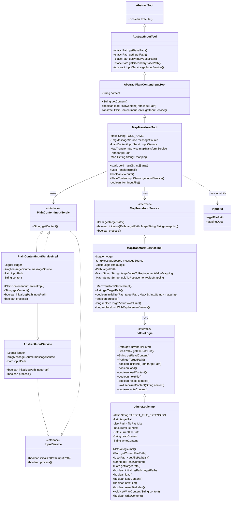
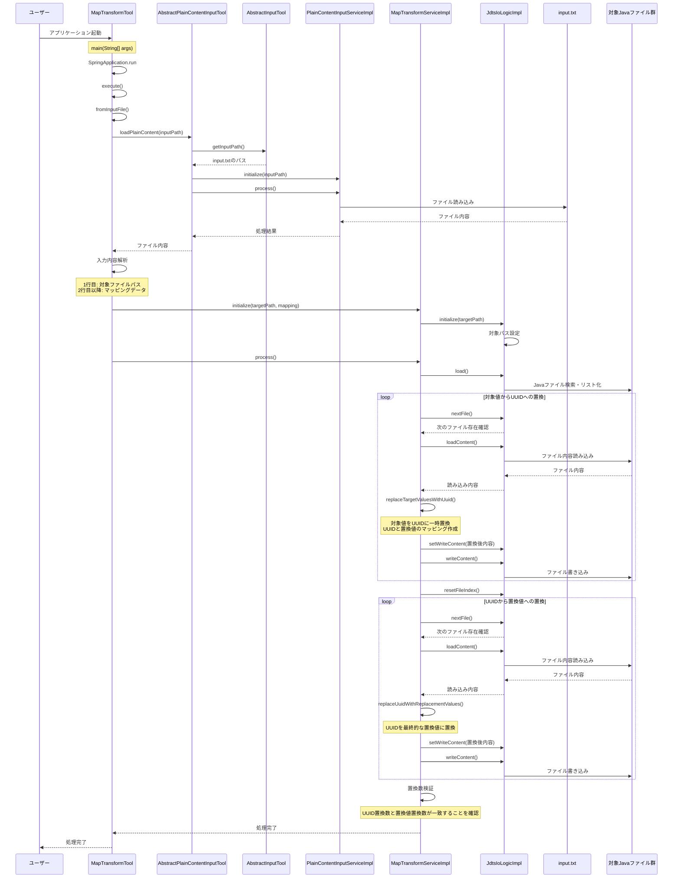

# マッピング変換ツール設計書

## 1. クラス図



## 2. シーケンス図



## 3. 入力ファイル構造

input.txt は以下の構造を持っています：

1. **1 行目**: 対象ファイルパス

   - マッピング変換を実行する対象のディレクトリまたはファイルパス

2. **2 行目以降**: マッピングデータ
   - 各行は「対象値,置換値」の形式
   - カンマ区切りで対象値と置換値を指定
   - 空行は無視される

### 入力ファイル例

```text
src/main/java/com/example
oldPackageName,newPackageName
oldClassName,newClassName
oldMethodName,newMethodName
```

## 4. 処理フロー詳細

1. ユーザーがアプリケーションを起動
2. SpringBoot アプリケーションが起動し、MapTransformTool のインスタンスが生成される
3. MapTransformTool の execute()メソッドが呼び出され、メイン処理が実行される
4. fromInputFile()メソッドが実行され、入力ファイルの処理が開始される：
   - AbstractInputTool.getInputPath()で入力ファイルパスを取得
   - PlainContentInputService を使用して input.txt を読み込み
   - 読み込んだ内容を行に分割して解析
   - 1 行目から対象ファイルパスを取得
   - 2 行目以降からマッピングデータを解析して Map に格納
5. MapTransformService の初期化と処理が実行される：
   - initialize()メソッドで対象パスとマッピングデータを設定
   - JdtsIoLogic を使用して対象ディレクトリから Java ファイルを検索・リスト化
6. 2 段階の置換処理が実行される：
   - **第 1 段階**: 対象値を UUID に一時置換
     - 各 Java ファイルの内容を読み込み
     - マッピングの対象値を UUID に置換
     - UUID と置換値のマッピングを作成
     - 置換後の内容をファイルに書き込み
   - **第 2 段階**: UUID を最終的な置換値に置換
     - 各 Java ファイルの内容を読み込み
     - UUID を対応する置換値に置換
     - 置換後の内容をファイルに書き込み
7. 置換数の整合性を検証（UUID 置換数と置換値置換数が一致することを確認）
8. 処理が完了し、結果がユーザーに返される

## 5. 主要コンポーネント

### MapTransformTool

- SpringBootApplication として動作するエントリーポイント
- AbstractPlainContentInputTool を継承（さらに AbstractInputTool を継承）
- PlainContentInputService を使用して入力ファイルを読み込み
- MapTransformService を使用してマッピング変換を実行

### AbstractPlainContentInputTool

- AbstractInputTool を継承
- プレーンコンテンツ（テキストファイル）の入力処理を担当
- 入力ファイルから文字列コンテンツを読み込む機能を提供

### AbstractInputTool

- AbstractTool を継承
- 入力ファイルパスの管理を担当
- work/io/input.txt を優先し、存在しない場合は src/main/resources/tool/io/input.txt を使用

### PlainContentInputServiceImpl

- AbstractInputService を継承
- PlainContentInputService インターフェースを実装
- 入力ファイルからプレーンテキストコンテンツを読み込む処理を担当

### MapTransformServiceImpl

- MapTransformService インターフェースを実装
- マッピング変換の実際の処理を担当
- JdtsIoLogic を使用して Java ファイルの入出力を管理
- 2 段階の置換処理（対象値 →UUID→ 置換値）を実装

### JdtsIoLogicImpl

- JdtsIoLogic インターフェースを実装
- Java ファイルの入出力処理を担当
- 対象ディレクトリから .java ファイルを検索・リスト化
- ファイルの読み込み・書き込み処理を提供

## 6. 特徴と利点

### 2 段階置換方式の採用

- **問題**: 直接置換では、置換値が他の対象値と重複する場合に意図しない置換が発生する可能性
- **解決**: 対象値 →UUID→ 置換値の 2 段階置換により、置換の安全性を確保
- **例**: `oldName,newName` と `newName,anotherName` のマッピングがある場合、直接置換では `oldName` が `anotherName` に置換されてしまうが、2 段階置換では正しく `newName` に置換される

### 置換数の整合性検証

- UUID 置換数と置換値置換数が一致することを確認
- 置換処理の正確性を保証

### 柔軟な入力ファイル形式

- シンプルなテキスト形式でマッピングデータを定義
- カンマ区切りで対象値と置換値を指定
- 空行の無視により、可読性の向上

### Spring Boot による依存性注入

- 各コンポーネントが疎結合で設計
- テスト容易性の向上
- 設定の柔軟性
