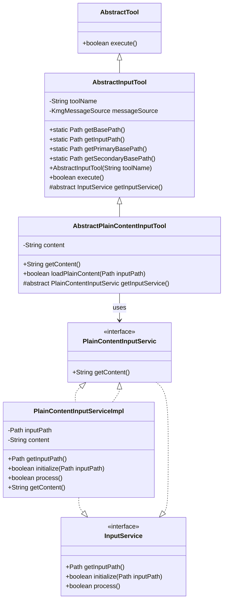
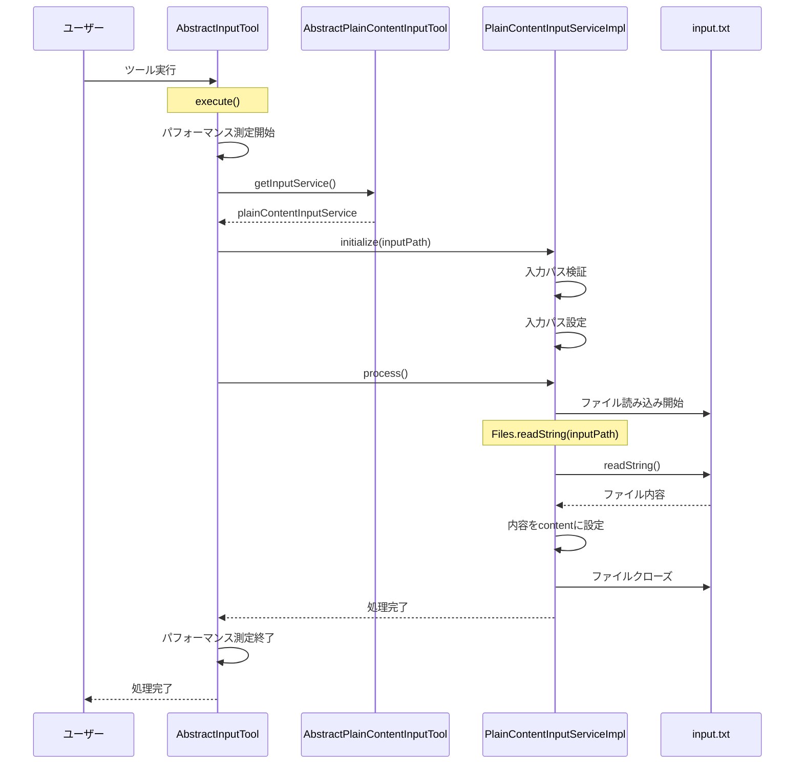

# 入力処理ツール設計書

## 1. クラス図



## 2. シーケンス図



## 3. 処理フロー詳細

1. **ツール実行開始**

   - ユーザーが AbstractInputTool を継承したツールを実行
   - AbstractInputTool の execute()メソッドが呼び出される

2. **初期化処理**

   - パフォーマンス測定サービスが開始される
   - 入力ファイルパスが自動解決される（優先パス: work/io/input.txt、代替パス: src/main/resources/tool/io/input.txt）

3. **サービス実行**

   - AbstractPlainContentInputTool の getInputService()メソッドが呼び出される
   - PlainContentInputServiceImpl の initialize()メソッドが実行され、入力ファイルパスが設定される

4. **ファイル処理**

   - PlainContentInputServiceImpl の process()メソッドが実行される
   - 入力ファイル（input.txt）を Files.readString()で読み込み
   - 読み込んだ内容を content フィールドに設定

5. **リソース解放**

   - ファイルの読み込みが完了
   - 処理結果を返す

6. **終了処理**

   - パフォーマンス測定が終了
   - 成功・失敗のメッセージがログ出力される

## 4. 主要コンポーネント

### AbstractInputTool

- **役割**: 入力処理の基本機能を提供する抽象クラス
- **継承関係**: AbstractTool を継承
- **主要機能**:
  - 入力ファイルパスの管理（優先パス: work/io、代替パス: src/main/resources/tool/io）
  - パフォーマンス測定サービスの統合
  - メイン処理の実行制御
  - エラーハンドリング

### AbstractPlainContentInputTool

- **役割**: プレーンコンテンツ入力処理の抽象クラス
- **継承関係**: AbstractInputTool を継承
- **主要機能**:
  - プレーンコンテンツの読み込み処理
  - 入力内容の取得機能
  - PlainContentInputServic の管理

### InputService

- **役割**: 入力処理の基本インターフェース
- **主要機能**:
  - 入力ファイルパスの取得
  - 初期化処理
  - 処理実行

### PlainContentInputServic

- **役割**: プレーンコンテンツ入力処理のインターフェース
- **継承関係**: InputService を継承
- **主要機能**:
  - 入力内容の取得

### PlainContentInputServiceImpl

- **役割**: プレーンコンテンツ入力処理の実際の処理を担当
- **実装関係**: PlainContentInputServic、InputService を実装
- **主要機能**:
  - 入力ファイルパスの管理
  - ファイルの初期化処理
  - 入力ファイルからプレーンコンテンツの読み込み処理

### ファイルパス管理

- **優先パス**: `work/io/input.txt`
- **代替パス**: `src/main/resources/tool/io/input.txt`
- **動作**: 優先パスにファイルが存在する場合はそちらを使用、存在しない場合は代替パスを使用

## 5. 設計の特徴

### シンプルな入力処理

- 複雑な変換処理を行わず、入力ファイルの内容をそのままプレーンコンテンツとして読み込む
- テンプレートファイルを使用しない単純な入力処理

### 柔軟なファイルパス管理

- 開発環境（work/io）と本番環境（src/main/resources/tool/io）の両方に対応
- ファイルの存在確認による自動的なパス切り替え

### SpringBoot 統合

- 依存性注入による疎結合な設計
- アノテーションベースの設定管理

### エラーハンドリング

- KmgToolMsgException による統一された例外処理
- ログ出力による処理状況の可視化

### パフォーマンス測定

- KmgPfaMeasService による処理時間の測定
- 処理開始・終了・エラー時のメッセージ出力

## 6. 使用例

### 基本的な使用方法

1. 入力ファイル（input.txt）を準備
2. AbstractInputTool を継承したツールを実行
3. プレーンコンテンツが読み込まれる

### ファイル配置

```text
work/io/
└── input.txt    # 入力ファイル（優先）

または

src/main/resources/tool/io/
└── input.txt    # 入力ファイル（代替）
```

### カスタム入力ツールの実装例

```java
@Service
public class CustomInputTool extends AbstractPlainContentInputTool {

    @Autowired
    private PlainContentInputServic plainContentInputService;

    @Override
    public PlainContentInputServic getInputService() {
        return this.plainContentInputService;
    }

    public void processCustomInput() {
        try {
            // 入力ファイルからプレーンコンテンツを読み込み
            boolean success = this.loadPlainContent(AbstractInputTool.getInputPath());
            if (success) {
                String content = this.getContent();
                // カスタム処理を実行
                processContent(content);
            }
        } catch (KmgToolMsgException e) {
            // エラーハンドリング
        }
    }

    private void processContent(String content) {
        // カスタム処理の実装
    }
}
```

### 実行コマンド

```bash
java -jar CustomInputTool.jar
```

## 7. パッケージ構成

```
kmg.tool.input/
├── domain/
│   └── service/
│       ├── InputService.java
│       ├── PlainContentInputServic.java
│       └── impl/
│           ├── AbstractInputService.java
│           └── PlainContentInputServiceImpl.java
└── presentation/
    └── ui/
        └── cli/
            ├── AbstractInputTool.java
            └── AbstractPlainContentInputTool.java
```

## 8. 設計思想

### 8.1 単一責任の原則

- 各クラスが明確な責任を持つ設計
- 入力処理、ファイル管理、エラーハンドリングの分離

### 8.2 依存性注入

- SpringBoot による依存性注入による疎結合な設計
- テスト時のモック化の容易性

### 8.3 拡張性

- 抽象クラスによる新機能追加時の影響範囲の限定
- インターフェースベースの設計による機能拡張の容易性

### 8.4 テスタビリティ

- 各コンポーネントの独立性による単体テストの容易性
- モック化しやすい設計

この設計書は、入力処理ツールの構造と動作を詳細に説明し、シンプル 1 入力 1 出力ツールの設計図と同様の形式で整理されています。
