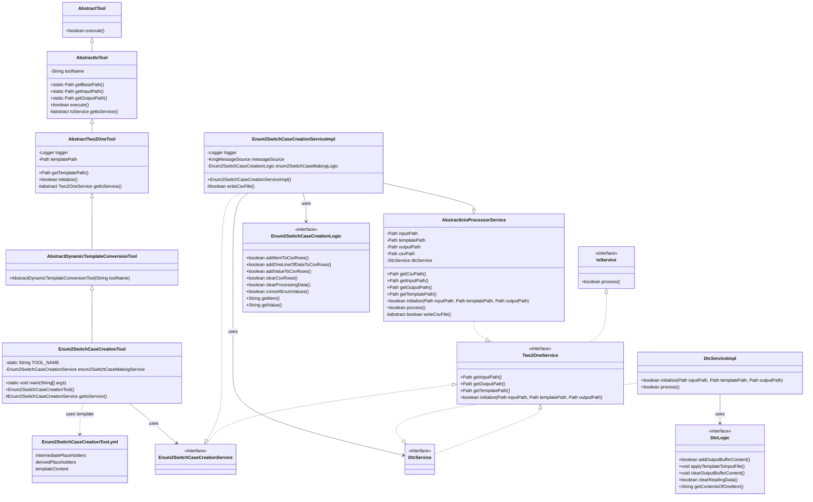
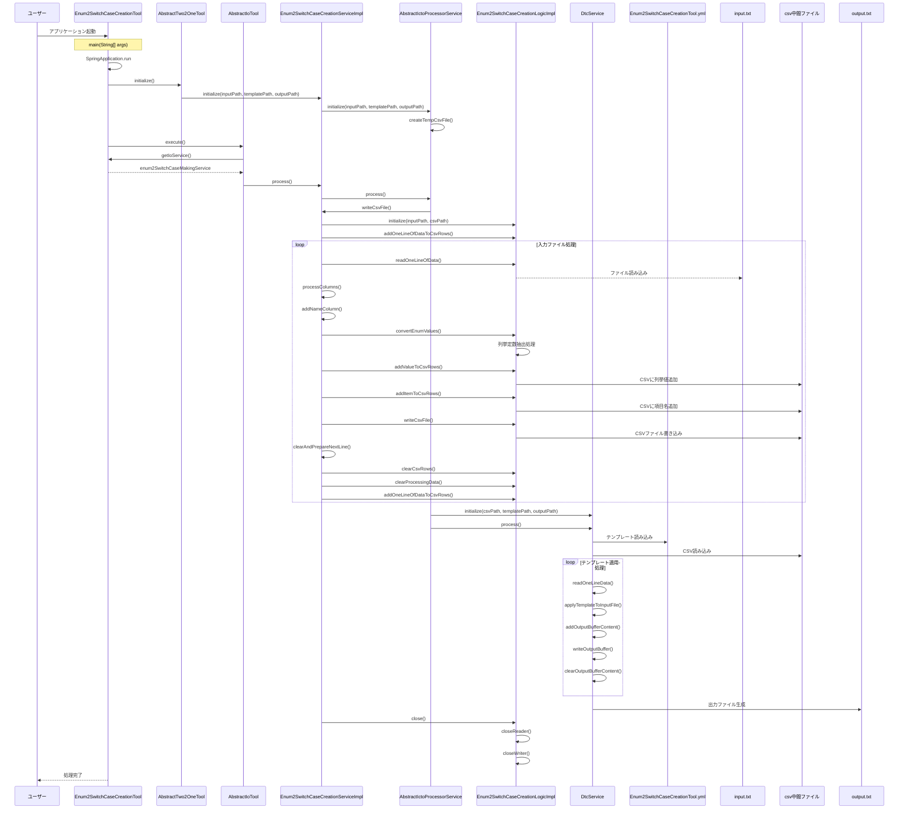

# 列挙型からcase文作成ツール設計書

## 1. クラス図

## 2. シーケンス図

## 3. テンプレートファイル構造

Enum2SwitchCaseCreationTool.ymlは以下の構造を持っています：

1. **intermediatePlaceholders**: 中間から直接取得するプレースホルダー定義
   - displayName: 画面表示用の名称
   - replacementPattern: 置換対象のパターン

2. **derivedPlaceholders**: CSVから取得した値を変換して生成するプレースホルダー定義
   - displayName: 画面表示用の名称
   - replacementPattern: 置換対象のパターン
   - sourceKey: 変換元となるCSVプレースホルダーのdisplayName
   - transformation: 適用する変換処理

3. **templateContent**: テンプレートの内容
   - {item}, {value}のプレースホルダーが実際の値に置換される

## 4. 処理フロー詳細

1. ユーザーがアプリケーションを起動
2. SpringBootアプリケーションが起動し、Enum2SwitchCaseCreationToolのインスタンスが生成される
3. AbstractTwo2OneToolのinitialize()メソッドが呼び出され、Enum2SwitchCaseCreationServiceが初期化される
4. AbstractIoToolのexecute()メソッドが呼び出され、メイン処理が実行される
5. Enum2SwitchCaseCreationServiceImplのwriteCsvFile()メソッドが実行され、入力ファイルの処理が開始される
6. 入力ファイルから1行ずつデータを読み込み、以下の処理を行う：
   - 列挙型定数の抽出と変換
   - 列挙型の値と項目名の抽出
   - CSV形式に変換して中間ファイルに書き込み
7. 中間ファイル（CSV）の生成が完了したら、DtcService（テンプレートの動的変換サービス）を使用して：
   - テンプレートファイル（Enum2SwitchCaseCreationTool.yml）を読み込む
   - 中間ファイル（CSV）のデータを読み込む
   - テンプレートにデータを適用して出力ファイルを生成する
8. リソースがクローズされ、処理が完了する

## 5. 主要コンポーネント

### Enum2SwitchCaseCreationTool

- SpringBootApplicationとして動作するエントリーポイント
- AbstractDynamicTemplateConversionToolを継承（さらにAbstractTwo2OneToolを継承）
- Enum2SwitchCaseCreationServiceを使用してswitch-case文生成を実行

### AbstractTwo2OneTool

- AbstractIoToolを継承
- テンプレートファイルパスの管理と初期化処理を担当

### Enum2SwitchCaseCreationServiceImpl

- AbstractIctoProcessorServiceを継承
- Enum2SwitchCaseCreationServiceインターフェースを実装
- 入力ファイルの読み込みとCSV形式への変換を担当

### Enum2SwitchCaseCreationLogicImpl

- switch-case文作成の実際のロジックを担当
- 列挙型定義からswitch-case文に必要な情報を抽出
- CSV形式の中間ファイルを生成

### DtcService（テンプレートの動的変換サービス）

- テンプレートファイルとCSVデータを使用して最終的な出力ファイルを生成
- プレースホルダの置換処理を担当

### テンプレートファイル（Enum2SwitchCaseCreationTool.yml）

- YAMLフォーマットで定義されたテンプレート設定ファイル
- 以下の主要セクションで構成：
  - `intermediatePlaceholders`: 中間から直接取得するプレースホルダー定義
  - `derivedPlaceholders`: CSVから取得した値を変換して生成するプレースホルダー定義
  - `templateContent`: 実際のテンプレート内容

#### intermediatePlaceholders

- CSVファイルの各列から直接マッピングされるプレースホルダー
  - `{item}`: 列挙型の項目名
  - `{value}`: 列挙型の値

#### derivedPlaceholders

- 既存のプレースホルダーから変換して生成される派生プレースホルダー
  - 必要に応じて定義される変換プレースホルダー

#### templateContent

- switch-case文のテンプレートを定義
- 上記のプレースホルダーを使用して、列挙型の各項目に対応するcase文を生成
