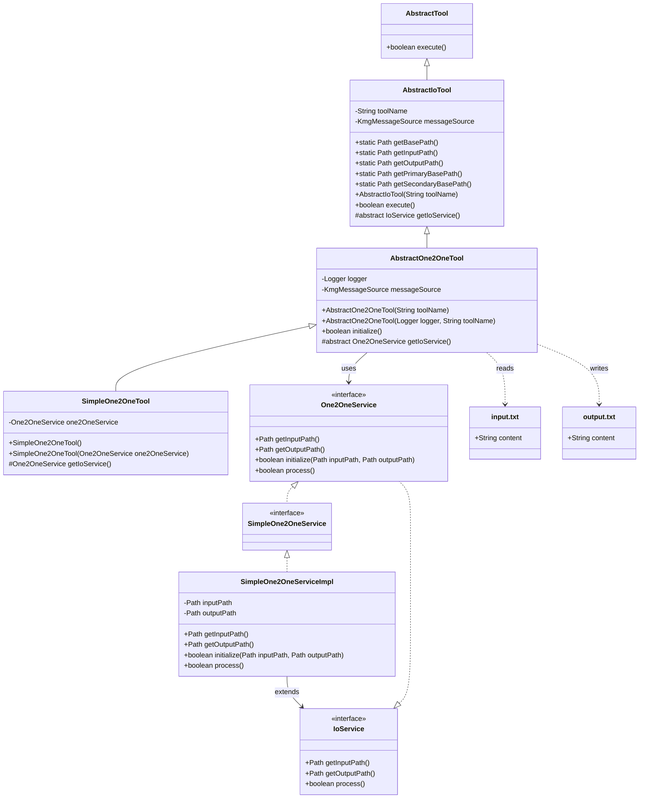
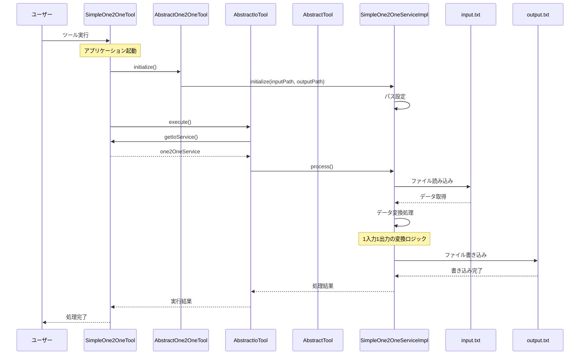

# 1 入力 1 出力変換ツール設計書

## 1. クラス図



## 2. シーケンス図



## 3. パッケージ構造

one2one パッケージは以下の階層構造を持っています：

```
kmg.tool.one2one/
├── application/                    # アプリケーション層
│   └── service/                    # サービス層
│       ├── SimpleOne2OneService.java
│       └── impl/
│           └── SimpleOne2OneServiceImpl.java
├── domain/                         # ドメイン層
│   └── service/
│       └── One2OneService.java
└── presentation/                   # プレゼンテーション層
    └── ui/
        └── cli/
            └── AbstractOne2OneTool.java
```

## 4. 処理フロー詳細

1. ユーザーが 1 入力 1 出力変換ツールを実行
2. `SimpleOne2OneTool`が`AbstractOne2OneTool`を継承して初期化
3. `AbstractOne2OneTool`の`initialize()`メソッドが呼び出され、`One2OneService`が初期化される
4. `AbstractIoTool`の`execute()`メソッドが呼び出され、メイン処理が実行される
5. `SimpleOne2OneServiceImpl`の`process()`メソッドが実行され、以下の処理が開始される：
   - 入力ファイルの読み込み
   - データの変換処理（1 入力 1 出力の変換ロジック）
   - 出力ファイルへの書き込み
6. 処理が完了し、結果が返される

## 5. 主要コンポーネント

### AbstractOne2OneTool

- `AbstractIoTool`を継承
- 1 入力 1 出力変換ツールの抽象クラス
- ログ機能とメッセージソースを提供
- `One2OneService`を使用して変換処理を実行

### One2OneService

- `IoService`を継承
- 1 入力 1 出力変換処理のドメインサービスインターフェース
- 入力ファイルパス、出力ファイルパス、初期化、処理メソッドを定義

### SimpleOne2OneService

- `One2OneService`を継承
- シンプルな 1 入力 1 出力変換処理のアプリケーションサービスインターフェース
- 基本的な変換処理を提供

### SimpleOne2OneServiceImpl

- `SimpleOne2OneService`を実装
- 1 入力 1 出力変換処理の具体的な実装
- 入力ファイルから出力ファイルへの直接的な変換処理を実行
- ファイルの読み書きとデータ変換を担当

### ファイル処理

- **入力ファイル**: `input.txt` - 変換対象のデータが格納されたファイル
- **出力ファイル**: `output.txt` - 変換結果が出力されるファイル
- ファイルパスは`AbstractIoTool`の静的メソッドで管理され、優先パスと代替パスが設定されている

## 6. 設計の特徴

### レイヤードアーキテクチャ

- **プレゼンテーション層**: CLI ツールの実装
- **アプリケーション層**: ビジネスロジックの実装
- **ドメイン層**: ドメイン固有のサービス定義

### 継承階層

- `AbstractTool` → `AbstractIoTool` → `AbstractOne2OneTool` → `SimpleOne2OneTool`
- 各階層で適切な責任分離を実現

### インターフェース分離

- `IoService` → `One2OneService` → `SimpleOne2OneService`
- 各層で必要な機能のみを定義

### 依存性注入

- Spring Framework を使用した依存性注入
- テスト容易性と保守性を向上

## 7. 拡張性

この設計により、以下のような拡張が可能です：

1. **新しい変換ロジックの追加**: `SimpleOne2OneServiceImpl`を継承して新しい実装を作成
2. **新しいツールの追加**: `AbstractOne2OneTool`を継承して新しいツールクラスを作成
3. **新しいサービス層の追加**: `One2OneService`を継承して新しいサービスインターフェースを作成
4. **新しいプレゼンテーション層の追加**: GUI 版や Web 版の実装が可能

この設計により、1 入力 1 出力変換ツールの機能を拡張しながら、保守性とテスタビリティを維持できます。
