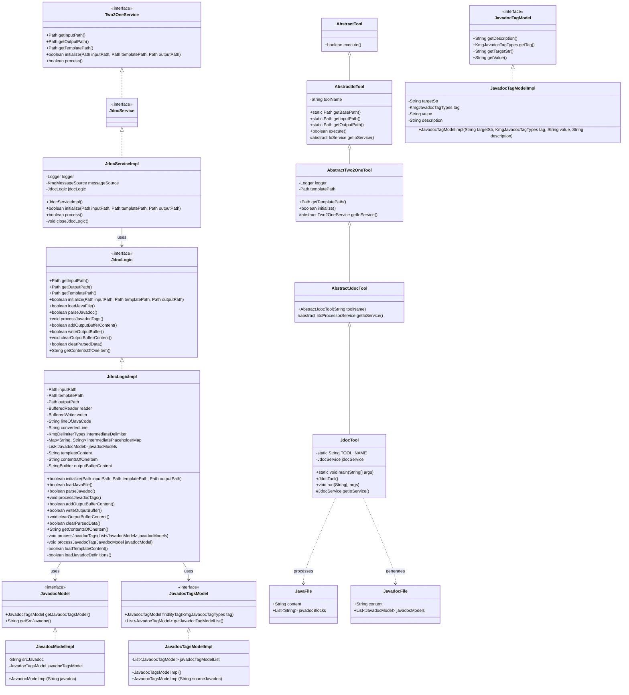
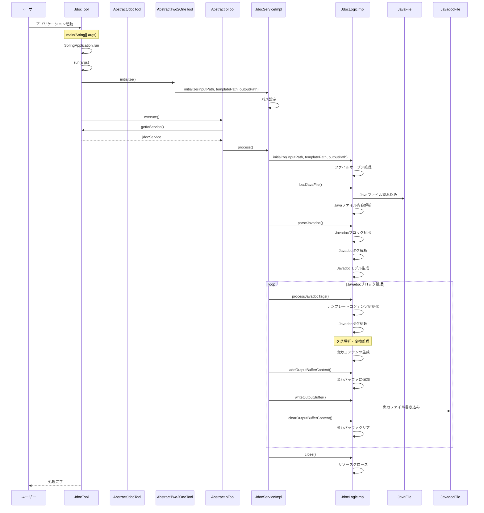

# Javadoc 処理の設計図

## 1. クラス図

## 2. シーケンス図

## 3. 処理フロー詳細

1. ユーザーがアプリケーションを起動
2. SpringBoot アプリケーションが起動し、JdocTool のインスタンスが生成される
3. AbstractTwo2OneTool の initialize()メソッドが呼び出され、JdocService が初期化される
4. AbstractIoTool の execute()メソッドが呼び出され、メイン処理が実行される
5. JdocServiceImpl の process()メソッドが実行され、以下の処理が開始される：
   - JdocLogic の初期化（入力ファイル、テンプレートファイル、出力ファイルのオープン）
   - Java ファイルの読み込みと内容解析
   - Javadoc ブロックの抽出と解析
   - Javadoc タグの処理と変換
   - テンプレートへのデータ適用と出力ファイル生成
6. リソースがクローズされ、処理が完了する

## 4. 主要コンポーネント

### JdocTool

- SpringBootApplication として動作するエントリーポイント
- AbstractJdocTool を継承（さらに AbstractTwo2OneTool を継承）
- JdocService を使用して Javadoc 処理を実行

### AbstractJdocTool

- AbstractTwo2OneTool を継承
- Javadoc 処理ツールの抽象クラス
- IitoProcessorService を返す抽象メソッドを定義

### AbstractTwo2OneTool

- AbstractIoTool を継承
- テンプレートファイルパスの管理と初期化処理を担当

### JdocServiceImpl

- Two2OneService インターフェースを実装
- JdocLogic を使用して Javadoc 処理を実行
- Java ファイルの読み込みと Javadoc ファイルの生成を担当

### JdocLogicImpl

- JdocLogic インターフェースを実装
- Javadoc 処理の実際のロジックを担当
- Java ファイルの解析と Javadoc ブロックの抽出
- Javadoc タグの解析と変換処理
- テンプレートへのデータ適用と出力ファイル生成

### JavadocModelImpl

- JavadocModel インターフェースを実装
- Javadoc の基本情報を管理
- 元の Javadoc 文字列とタグ情報を保持

### JavadocTagsModelImpl

- JavadocTagsModel インターフェースを実装
- Javadoc タグの一覧情報を管理
- 正規表現を使用したタグの抽出と解析
- タグの検索機能を提供

### JavadocTagModelImpl

- JavadocTagModel インターフェースを実装
- 個別の Javadoc タグ情報を管理
- タグの種類、値、説明などの詳細情報を保持

## 5. 処理対象ファイル

### JavaFile

- 入力となる Java ソースファイル
- Javadoc コメントが含まれる Java コード
- クラス、メソッド、フィールドなどの定義

### JavadocFile

- 出力される Javadoc ファイル
- 解析された Javadoc 情報を構造化した形式
- タグ情報や説明文が整理された形式

## 6. Javadoc タグ処理

### 対応タグ

- `@author`: 作成者情報
- `@since`: バージョン情報
- `@version`: バージョン番号
- `@param`: パラメータ説明
- `@return`: 戻り値説明
- `@throws`: 例外説明
- その他の標準 Javadoc タグ

### タグ解析処理

1. 正規表現を使用したタグの抽出
2. タグの種類と値の分離
3. 説明文の解析と整形
4. タグ情報のモデル化
5. 出力形式への変換

## 7. 拡張性

### カスタムタグ対応

- 新しい Javadoc タグの追加が容易
- タグの解析ロジックの拡張
- 出力形式のカスタマイズ

### テンプレート機能

- 出力形式のテンプレート化
- プレースホルダーによる動的生成
- 複数出力形式の対応
