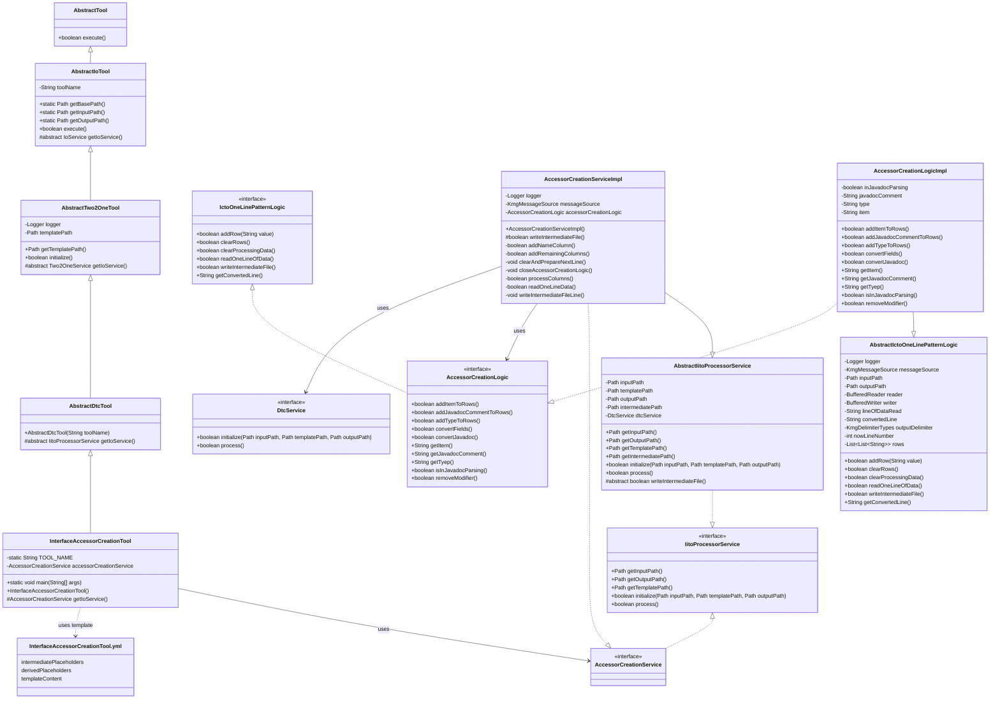
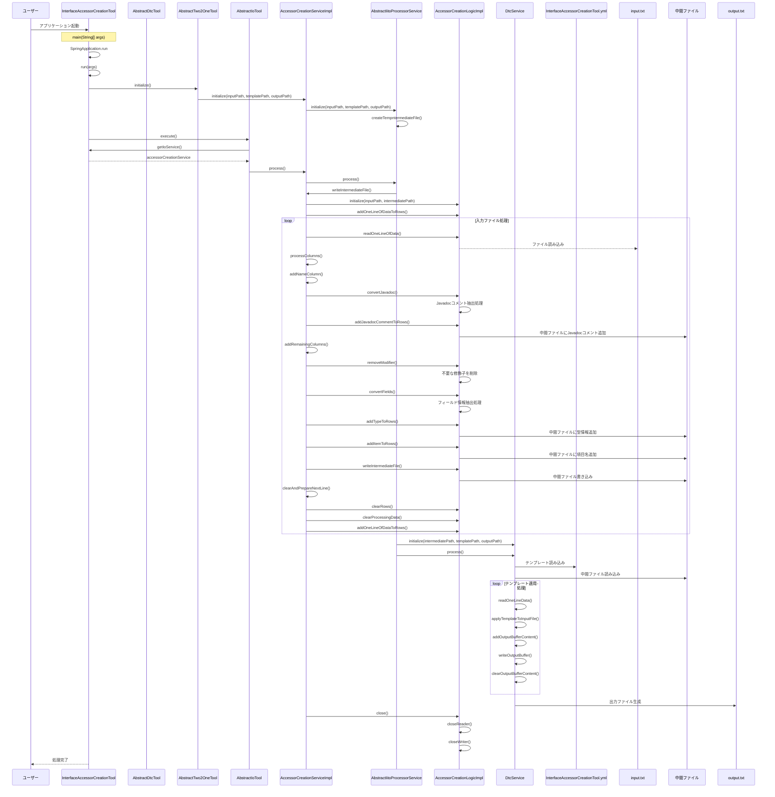

# インタフェースアクセサ作成ツール設計書

## 1. クラス図

## 2. シーケンス図

## 3. テンプレートファイル構造

InterfaceAccessorCreationTool.yml は以下の構造を持っています：

1. **intermediatePlaceholders**: 中間ファイルから直接取得するプレースホルダー定義

   - displayName: 画面表示用の名称
   - replacementPattern: 置換対象のパターン

2. **derivedPlaceholders**: 中間ファイルから取得した値を変換して生成するプレースホルダー定義

   - displayName: 画面表示用の名称
   - replacementPattern: 置換対象のパターン
   - sourceKey: 変換元となる中間プレースホルダーの displayName
   - transformation: 適用する変換処理

3. **templateContent**: テンプレートの内容
   - {name}, {type}, {item}, {capitalize}のプレースホルダーが実際の値に置換される

## 4. 処理フロー詳細

1. ユーザーがアプリケーションを起動
2. SpringBoot アプリケーションが起動し、InterfaceAccessorCreationTool のインスタンスが生成される
3. AbstractTwo2OneTool の initialize()メソッドが呼び出され、AccessorCreationService が初期化される
4. AbstractIoTool の execute()メソッドが呼び出され、メイン処理が実行される
5. AccessorCreationServiceImpl の writeIntermediateFile()メソッドが実行され、入力ファイルの処理が開始される
6. 入力ファイルから 1 行ずつデータを読み込み、以下の処理を行う：
   - Javadoc コメントの抽出と変換
   - 不要な修飾子（final や static）の削除
   - フィールド定義から型情報と項目名の抽出
   - 中間ファイル形式に変換して中間ファイルに書き込み
7. 中間ファイルの生成が完了したら、DtcService（テンプレートの動的変換サービス）を使用して：
   - テンプレートファイル（InterfaceAccessorCreationTool.yml）を読み込む
   - 中間ファイルのデータを読み込む
   - テンプレートにデータを適用して出力ファイルを生成する
8. リソースがクローズされ、処理が完了する

## 5. 主要コンポーネント

### InterfaceAccessorCreationTool

- SpringBootApplication として動作するエントリーポイント
- AbstractDtcTool を継承（さらに AbstractTwo2OneTool を継承）
- AccessorCreationService を使用してインタフェース用アクセサ生成を実行

### AbstractDtcTool

- AbstractTwo2OneTool を継承
- テンプレートの動的変換ツールの抽象クラス
- IitoProcessorService を返す抽象メソッドを定義

### AbstractTwo2OneTool

- AbstractIoTool を継承
- テンプレートファイルパスの管理と初期化処理を担当

### AccessorCreationServiceImpl

- AbstractIitoProcessorService を継承
- AccessorCreationService インターフェースを実装
- 入力ファイルの読み込みと中間ファイル形式への変換を担当

### AccessorCreationLogicImpl

- AbstractIctoOneLinePatternLogic を継承
- AccessorCreationLogic インターフェースを実装
- アクセサ作成の実際のロジックを担当
- フィールド定義からアクセサメソッドに必要な情報を抽出
- 中間ファイル形式の中間ファイルを生成

### DtcService（テンプレートの動的変換サービス）

- テンプレートファイルと中間ファイルデータを使用して最終的な出力ファイルを生成
- プレースホルダの置換処理を担当

### テンプレートファイル（InterfaceAccessorCreationTool.yml）

- YAML フォーマットで定義されたテンプレート設定ファイル
- 以下の主要セクションで構成：
  - `intermediatePlaceholders`: 中間ファイルから直接取得するプレースホルダー定義
  - `derivedPlaceholders`: 中間ファイルから取得した値を変換して生成するプレースホルダー定義
  - `templateContent`: 実際のテンプレート内容

#### intermediatePlaceholders

- 中間ファイルの各列から直接マッピングされるプレースホルダー
  - `{name}`: フィールドの名称（Javadoc コメント）
  - `{type}`: フィールドの型
  - `{item}`: フィールド名

#### derivedPlaceholders

- 既存のプレースホルダーから変換して生成される派生プレースホルダー
  - `{capitalize}`: 項目名の先頭を大文字にした値（例: item → Item）
  - 変換元: `項目`（`{item}`）
  - 変換処理: `capitalize`（先頭大文字化）

#### templateContent

- インタフェース用の getter と setter のテンプレートを定義
- 上記のプレースホルダーを使用して、フィールドごとにカスタマイズされたアクセサメソッドを生成
- 各メソッドには Javadoc コメントも含まれる

## 6. 特徴

### インタフェース専用設計

- 通常のアクセサ作成ツールとは異なり、インタフェース用のメソッド定義を生成
- 実装ではなく、メソッドの宣言のみを生成
- インタフェースの特性に合わせた Javadoc コメントを自動生成

### 柔軟なテンプレートシステム

- YAML 形式のテンプレート設定により、出力形式をカスタマイズ可能
- プレースホルダーの変換機能により、動的な値の生成が可能
- 中間ファイルを経由することで、複雑な変換処理を実現

### 堅牢なエラーハンドリング

- 各段階での適切な例外処理
- ログ出力による処理状況の可視化
- リソースの適切な管理とクリーンアップ
