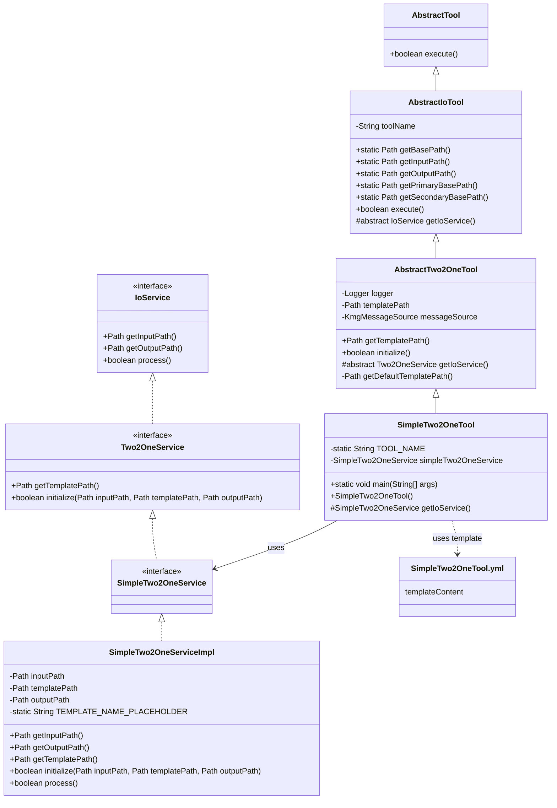
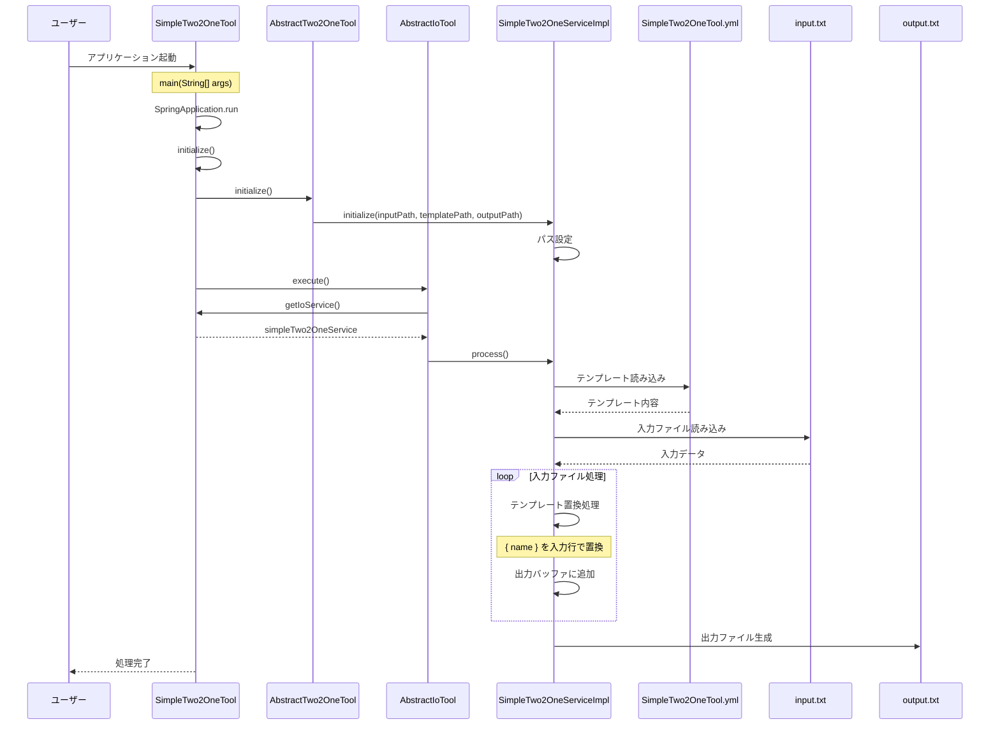

# シンプル 2 入力 1 出力ツール設計書

## 1. クラス図



## 2. シーケンス図



## 3. テンプレートファイル構造

SimpleTwo2OneTool.yml は以下の構造を持っています：

1. **templateContent**: テンプレートの内容
   - `{ name }` プレースホルダーが実際の入力値に置換される
   - 入力ファイルの各行に対してテンプレートが適用される

### テンプレートファイル例

```yaml
templateContent: |
  /**
   * { name }の説明
   *
   * @since 0.1.0
   */
  public void process{ name }() {
      // { name }の処理
  }
```

## 4. 処理フロー詳細

1. ユーザーがアプリケーションを起動
2. SpringBoot アプリケーションが起動し、SimpleTwo2OneTool のインスタンスが生成される
3. AbstractTwo2OneTool の initialize()メソッドが呼び出され、SimpleTwo2OneService が初期化される
4. AbstractIoTool の execute()メソッドが呼び出され、メイン処理が実行される
5. SimpleTwo2OneServiceImpl の process()メソッドが実行され、以下の処理が行われる：
   - テンプレートファイル（SimpleTwo2OneTool.yml）を読み込む
   - 入力ファイル（input.txt）を 1 行ずつ読み込む
   - 各行に対してテンプレートの `{ name }` プレースホルダーを入力行の内容で置換
   - 置換されたテンプレートを出力バッファに追加
6. 全ての入力行の処理が完了したら、出力バッファの内容を出力ファイル（output.txt）に書き込む
7. 処理が完了する

## 5. 主要コンポーネント

### SimpleTwo2OneTool

- SpringBootApplication として動作するエントリーポイント
- AbstractTwo2OneTool を継承
- SimpleTwo2OneService を使用してシンプルな 2 入力 1 出力変換を実行

### AbstractTwo2OneTool

- AbstractIoTool を継承
- テンプレートファイルパスの管理と初期化処理を担当
- テンプレートファイルパスは `template/SimpleTwo2OneTool.yml` 形式で自動決定される

### AbstractIoTool

- AbstractTool を継承
- 入出力ファイルパスの管理を担当
- 入力ファイル：`work/io/input.txt` または `src/main/resources/tool/io/input.txt`
- 出力ファイル：`work/io/output.txt` または `src/main/resources/tool/io/output.txt`

### SimpleTwo2OneServiceImpl

- SimpleTwo2OneService インターフェースを実装
- 入力ファイルとテンプレートファイルを使用して出力ファイルを生成
- テンプレートの `{ name }` プレースホルダーを入力行の内容で置換する処理を担当

### テンプレートファイル（SimpleTwo2OneTool.yml）

- YAML フォーマットで定義されたテンプレート設定ファイル
- `templateContent` セクションで実際のテンプレート内容を定義
- `{ name }` プレースホルダーが入力ファイルの各行の内容に置換される

#### templateContent

- 入力ファイルの各行に対して適用されるテンプレートを定義
- `{ name }` プレースホルダーを使用して、入力行ごとにカスタマイズされた出力を生成
- 各行の処理結果が連結されて最終的な出力ファイルが生成される

## 6. ファイル配置

### 入力ファイル

- 優先パス：`work/io/input.txt`
- 代替パス：`src/main/resources/tool/io/input.txt`

### テンプレートファイル

- 優先パス：`work/io/template/SimpleTwo2OneTool.yml`
- 代替パス：`src/main/resources/tool/io/template/SimpleTwo2OneTool.yml`

### 出力ファイル

- 優先パス：`work/io/output.txt`
- 代替パス：`src/main/resources/tool/io/output.txt`

## 7. 使用例

### 入力ファイル（input.txt）

```text
User
Product
Order
```

### 使用例のテンプレートファイル（SimpleTwo2OneTool.yml）

```yaml
templateContent: |
  /**
   * { name }の処理
   *
   * @since 0.1.0
   */
  public void process{ name }() {
      // { name }の処理ロジック
  }
```

### 出力ファイル（output.txt）

```java
/**
 * Userの処理
 *
 * @since 0.1.0
 */
public void processUser() {
    // Userの処理ロジック
}

/**
 * Productの処理
 *
 * @since 0.1.0
 */
public void processProduct() {
    // Productの処理ロジック
}

/**
 * Orderの処理
 *
 * @since 0.1.0
 */
public void processOrder() {
    // Orderの処理ロジック
}
```
