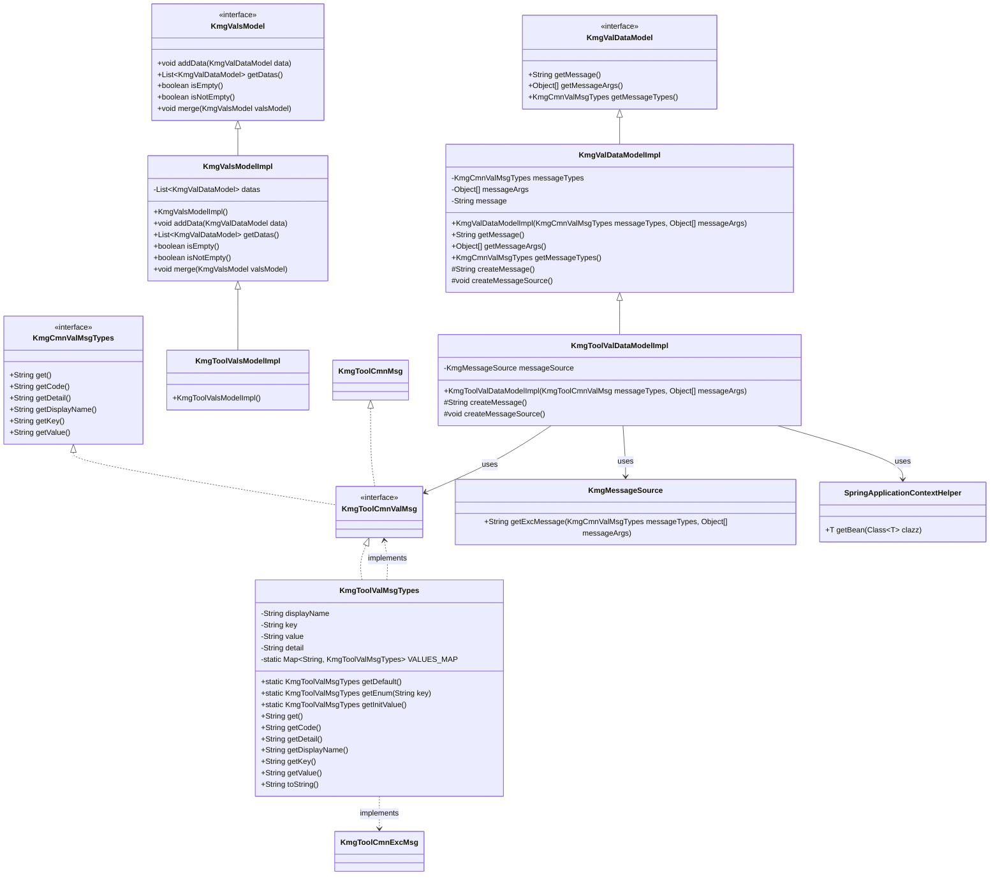
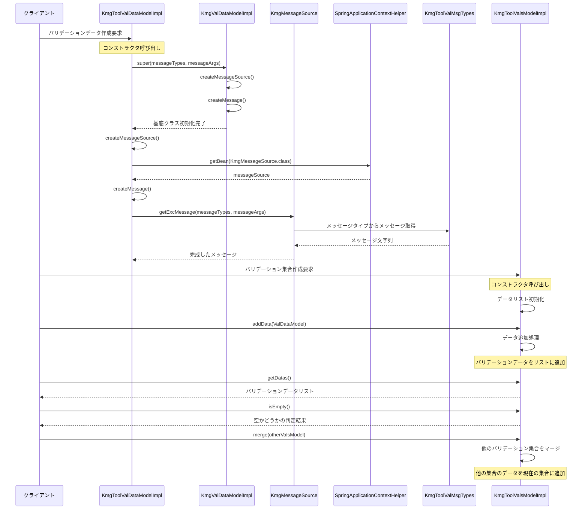

# バリデーション機能設計書

## 1. クラス図

## 2. シーケンス図

## 3. バリデーションメッセージ構造

KmgToolValMsgTypes は以下の構造を持っています：

1. **基本メッセージ**: 一般的なバリデーションエラーメッセージ

   - NONE: 指定無し
   - KMGTOOL_VAL13000: YAML データが空です

2. **設定関連メッセージ**: 設定ファイルやパラメータの検証

   - KMGTOOL_VAL13001: 空の設定項目エラー
   - KMGTOOL_VAL13002: 条件付き設定項目エラー
   - KMGTOOL_VAL13003: 無効な値エラー
   - KMGTOOL_VAL13004: 対象要素未指定エラー
   - KMGTOOL_VAL13005: 必須項目未指定エラー
   - KMGTOOL_VAL13006: 存在しない項目エラー
   - KMGTOOL_VAL13007: 設定項目未指定エラー
   - KMGTOOL_VAL13008: 設定値不正エラー
   - KMGTOOL_VAL13009: 設定値不正エラー

3. **Java 解析関連メッセージ**: Java コード解析時のエラー

   - KMGTOOL_VAL13010: Java 区分から要素名取得エラー

## 4. 処理フロー詳細

1. クライアントがバリデーションデータの作成を要求
2. KmgToolValDataModelImpl のコンストラクタが呼び出される
3. 基底クラス KmgValDataModelImpl の初期化処理が実行される：
   - メッセージタイプと引数の設定
   - メッセージソースの作成
   - メッセージの生成
4. KmgToolValDataModelImpl 固有の処理が実行される：
   - SpringApplicationContextHelper を使用して KmgMessageSource を取得
   - メッセージの生成（Spring コンテキストを使用）
5. バリデーション集合の管理：
   - KmgToolValsModelImpl でバリデーションデータの集合を管理
   - データの追加、取得、空チェック、マージ機能を提供
6. バリデーション結果の利用：
   - クライアントはバリデーションデータからメッセージを取得
   - バリデーション集合から複数のエラー情報を管理

## 5. 主要コンポーネント

### KmgToolValDataModelImpl

- KmgValDataModelImpl を継承した KMG ツール専用のバリデーションデータモデル
- Spring コンテキストを使用してメッセージソースを取得
- KmgToolCmnValMsg を使用してツール専用のメッセージタイプを管理

### KmgToolValsModelImpl

- KmgValsModelImpl を継承した KMG ツール専用のバリデーション集合モデル
- 複数のバリデーションデータを管理する機能を提供
- データの追加、取得、空チェック、マージ機能を実装

### KmgToolValMsgTypes

- KMG ツール専用のバリデーションメッセージタイプを定義
- 設定ファイル検証、Java 解析、一般的なバリデーションエラーに対応
- メッセージのキー、値、表示名、詳細情報を管理

### KmgToolCmnValMsg

- KMG ツール共通のバリデーションメッセージインターフェース
- KmgCmnValMsgTypes と KmgToolCmnMsg を継承
- ツール群で共通して使用されるメッセージ管理を提供

### メッセージ管理システム

- SpringApplicationContextHelper を使用して KmgMessageSource を取得
- 国際化対応のメッセージ管理
- メッセージタイプと引数を使用した動的メッセージ生成
- エラーコードとメッセージの一元管理

#### メッセージタイプの分類

- **基本メッセージ**: 一般的なバリデーションエラー
- **設定関連メッセージ**: 設定ファイルやパラメータの検証エラー
- **Java 解析関連メッセージ**: Java コード解析時のエラー

#### メッセージの特徴

- プレースホルダー（{0}, {1}など）を使用した動的メッセージ生成
- エラーコードによる一意な識別
- 表示名と詳細情報の分離
- マップによる高速なメッセージタイプ検索
