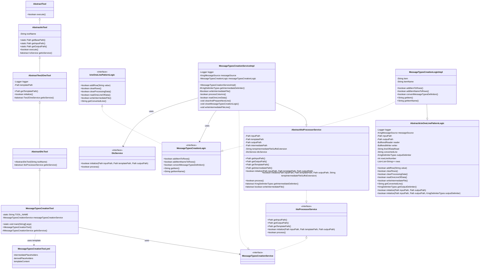
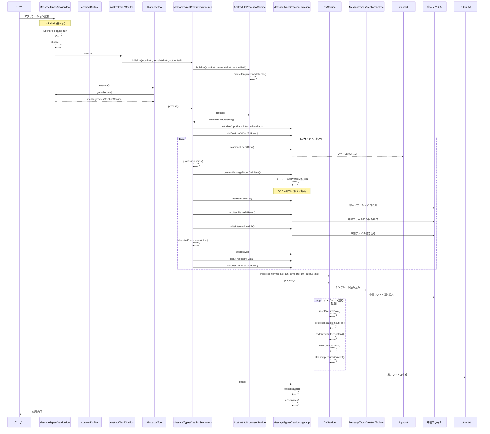

# メッセージの種類作成ツール設計書

## 1. クラス図



## 2. シーケンス図



## 3. テンプレートファイル構造

MessageTypesCreationTool.yml は以下の構造を持っています：

1. **intermediatePlaceholders**: 中間ファイルから直接取得するプレースホルダー定義

   - displayName: 画面表示用の名称
   - replacementPattern: 置換対象のパターン

2. **derivedPlaceholders**: 中間ファイルから取得した値を変換して生成するプレースホルダー定義

   - displayName: 画面表示用の名称
   - replacementPattern: 置換対象のパターン
   - sourceKey: 変換元となる中間プレースホルダーの displayName
   - transformation: 適用する変換処理

3. **templateContent**: テンプレートの内容
   - {item}, {itemName}のプレースホルダーが実際の値に置換される

## 4. 処理フロー詳細

1. ユーザーがアプリケーションを起動
2. SpringBoot アプリケーションが起動し、MessageTypesCreationTool のインスタンスが生成される
3. AbstractTwo2OneTool の initialize()メソッドが呼び出され、MessageTypesCreationService が初期化される
4. AbstractIoTool の execute()メソッドが呼び出され、メイン処理が実行される
5. MessageTypesCreationServiceImpl の writeIntermediateFile()メソッドが実行され、入力ファイルの処理が開始される
6. 入力ファイルから 1 行ずつデータを読み込み、以下の処理を行う：
   - メッセージ種類定義の解析（"項目=項目名"形式）
   - 項目と項目名の抽出
   - 中間ファイル形式に変換して中間ファイルに書き込み
7. 中間ファイルの生成が完了したら、DtcService（テンプレートの動的変換サービス）を使用して：
   - テンプレートファイル（MessageTypesCreationTool.yml）を読み込む
   - 中間ファイルのデータを読み込む
   - テンプレートにデータを適用して出力ファイルを生成する
8. リソースがクローズされ、処理が完了する

## 5. 主要コンポーネント

### MessageTypesCreationTool

- SpringBootApplication として動作するエントリーポイント
- AbstractDtcTool を継承（さらに AbstractTwo2OneTool を継承）
- MessageTypesCreationService を使用してメッセージ種類生成を実行

### AbstractDtcTool

- AbstractTwo2OneTool を継承
- テンプレートの動的変換ツールの抽象クラス
- IitoProcessorService を返す抽象メソッドを定義

### AbstractTwo2OneTool

- AbstractIoTool を継承
- テンプレートファイルパスの管理と初期化処理を担当

### MessageTypesCreationServiceImpl

- AbstractIitoProcessorService を継承
- MessageTypesCreationService インターフェースを実装
- 入力ファイルの読み込みと中間ファイル形式への変換を担当

### MessageTypesCreationLogicImpl

- AbstractIctoOneLinePatternLogic を継承
- MessageTypesCreationLogic インターフェースを実装
- メッセージ種類作成の実際のロジックを担当
- メッセージ種類定義から項目と項目名を抽出
- 中間ファイル形式の中間ファイルを生成

### DtcService（テンプレートの動的変換サービス）

- テンプレートファイルと中間ファイルデータを使用して最終的な出力ファイルを生成
- プレースホルダの置換処理を担当

### テンプレートファイル（MessageTypesCreationTool.yml）

- YAML フォーマットで定義されたテンプレート設定ファイル
- 以下の主要セクションで構成：
  - `intermediatePlaceholders`: 中間ファイルから直接取得するプレースホルダー定義
  - `derivedPlaceholders`: 中間ファイルから取得した値を変換して生成するプレースホルダー定義
  - `templateContent`: 実際のテンプレート内容

#### intermediatePlaceholders

- 中間ファイルの各列から直接マッピングされるプレースホルダー
  - `{item}`: メッセージ種類の項目（例：KMGTOOL_GEN14000）
  - `{itemName}`: メッセージ種類の項目名（例：メッセージの種類が指定されていません。）

#### derivedPlaceholders

- 既存のプレースホルダーから変換して生成される派生プレースホルダー
- 現在は空の配列（将来の拡張用）

#### templateContent

- メッセージ種類の定義テンプレートを定義
- 上記のプレースホルダーを使用して、メッセージ種類ごとにカスタマイズされた定義を生成
- 各定義には Javadoc コメントも含まれる

## 6. 入力ファイル形式

入力ファイルは以下の形式で記述されたテキストファイルです：

```test
項目=項目名
```

例：

```test
KMGTOOL_GEN14000=メッセージの種類が指定されていません。
KMGTOOL_GEN14001=項目が指定されていません。
KMGTOOL_GEN14002=メッセージの種類定義の形式が正しくありません。行番号：{0}、内容：{1}
```

## 7. 出力ファイル形式

出力ファイルは、テンプレートに基づいて生成される Java 列挙型の定義ファイルです：

```java
/**
 * メッセージの種類が指定されていません。
 *
 * @since 0.1.0
 */
KMGTOOL_GEN14000("メッセージの種類が指定されていません。"),

/**
 * 項目が指定されていません。
 *
 * @since 0.1.0
 */
KMGTOOL_GEN14001("項目が指定されていません。"),
```

## 8. エラーハンドリング

- 入力ファイルの形式が正しくない場合（"="で分割できない場合）は KmgToolMsgException を投げる
- ファイルの読み込み・書き込みエラーは適切にログ出力され、例外として上位に伝播される
- 各処理段階でエラーが発生した場合は、適切なエラーメッセージと共に処理を中断する
