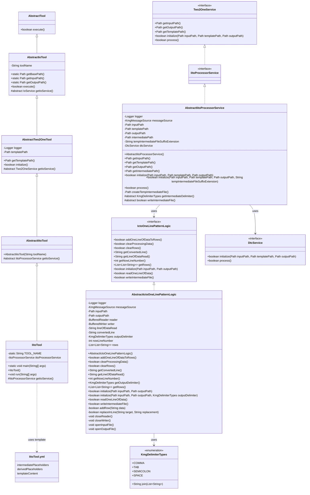
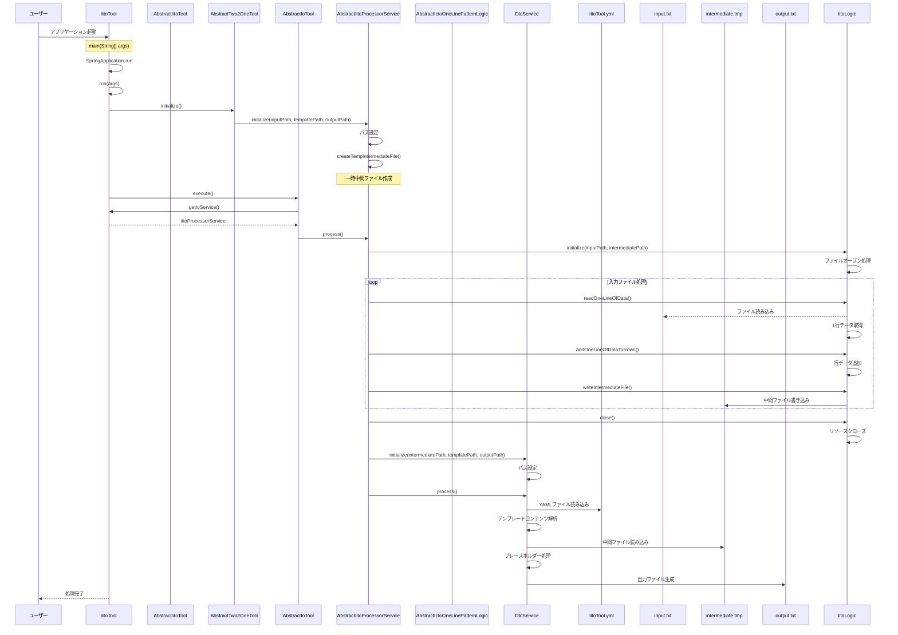
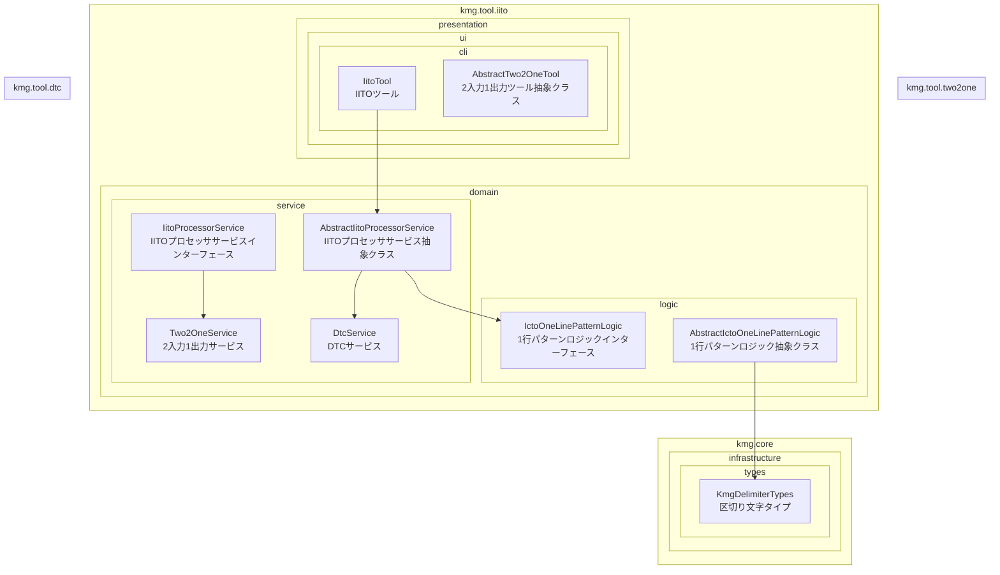

# 入力、中間、テンプレート、出力設計図

## 1. クラス図



## 2. シーケンス図



## 3. パッケージ構成図



## 4. 処理フロー詳細

1. ユーザーがアプリケーションを起動
2. SpringBoot アプリケーションが起動し、IitoTool のインスタンスが生成される
3. AbstractTwo2OneTool の initialize()メソッドが呼び出され、IitoProcessorService が初期化される
4. 一時的な中間ファイルが作成される
5. AbstractIoTool の execute()メソッドが呼び出され、メイン処理が実行される
6. AbstractIitoProcessorService の process()メソッドが実行され、以下の処理が開始される：
   - AbstractIctoOneLinePatternLogic の初期化（入力ファイル、中間ファイルのオープン）
   - 入力ファイルから 1 行ずつデータを読み込み、中間ファイルに書き込む
   - 中間ファイルの処理完了後、DtcService を使用してテンプレート変換を実行
   - 最終的な出力ファイルを生成
7. リソースがクローズされ、処理が完了する

## 5. 主要コンポーネント

### IitoTool

- SpringBootApplication として動作するエントリーポイント
- AbstractIitoTool を継承（さらに AbstractTwo2OneTool を継承）
- IitoProcessorService を使用して入力 → 中間 → 出力処理を実行

### AbstractIitoTool

- AbstractTwo2OneTool を継承
- 入力 → 中間 → 出力ツールの抽象クラス
- IitoProcessorService を返す抽象メソッドを定義

### AbstractIitoProcessorService

- Two2OneService インターフェースを実装
- AbstractIctoOneLinePatternLogic を使用して入力ファイルから中間ファイルへの変換処理を実行
- DtcService を使用して中間ファイルから最終出力ファイルへの変換処理を実行
- 一時的な中間ファイルの作成と管理を担当

### AbstractIctoOneLinePatternLogic

- IctoOneLinePatternLogic インターフェースを実装
- 入力ファイルから中間ファイルへの変換の実際のロジックを担当
- 1 行ずつデータを読み込み、指定された区切り文字で区切って中間ファイルに出力
- ファイルの読み込み、変換、書き込み処理を管理

### IctoOneLinePatternLogic

- 入力 → 中間 → 出力の 1 行パターン処理のインターフェース
- ファイルの初期化、データ読み込み、変換、書き込みの基本操作を定義
- 行データの管理とクリア機能を提供

### DtcService

- テンプレートの動的変換サービス
- 中間ファイルとテンプレートファイルを使用して最終出力ファイルを生成
- プレースホルダーの置換とテンプレート処理を実行

## 6. 設計思想

### 6.1 段階的処理

- 入力ファイル → 中間ファイル → 最終出力ファイルの 3 段階処理
- 各段階でのデータ変換と検証を可能にする
- 処理の分離による保守性の向上

### 6.2 再利用性

- AbstractIctoOneLinePatternLogic による 1 行パターン処理の抽象化
- 異なる入力形式に対応可能な拡張性
- テンプレート処理との組み合わせによる柔軟性

### 6.3 一時ファイル管理

- 自動的な一時ファイルの作成と削除
- 処理完了後のリソースクリーンアップ
- エラー時の適切なリソース解放

### 6.4 テンプレート連携

- DtcService との連携による高度なテンプレート処理
- 中間ファイルを介したデータ変換の柔軟性
- プレースホルダー処理の分離

## 7. 使用例

### 7.1 基本的な IITO ツール実装

```java
public class CustomIitoTool extends AbstractIitoTool {
    private final IitoProcessorService iitoProcessorService;

    public CustomIitoTool(String toolName, IitoProcessorService iitoProcessorService) {
        super(toolName);
        this.iitoProcessorService = iitoProcessorService;
    }

    @Override
    protected IitoProcessorService getIoService() {
        return this.iitoProcessorService;
    }
}
```

### 7.2 1 行パターンロジックの実装

```java
public class CustomIctoOneLinePatternLogic extends AbstractIctoOneLinePatternLogic {

    @Override
    protected boolean processLine() {
        // カスタム行処理ロジック
        return this.addRow(this.getLineOfDataRead());
    }
}
```

### 7.3 中間ファイル処理

```java
// 入力ファイルから中間ファイルへの変換
iitoLogic.initialize(inputPath, intermediatePath);
while (iitoLogic.readOneLineOfData()) {
    // 行データの処理
    iitoLogic.addOneLineOfDataToRows();
}
iitoLogic.writeIntermediateFile();

// 中間ファイルから最終出力への変換
dtcService.initialize(intermediatePath, templatePath, outputPath);
dtcService.process();
```
