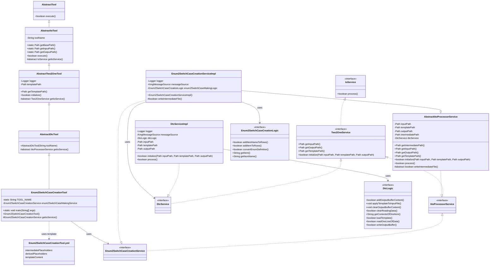
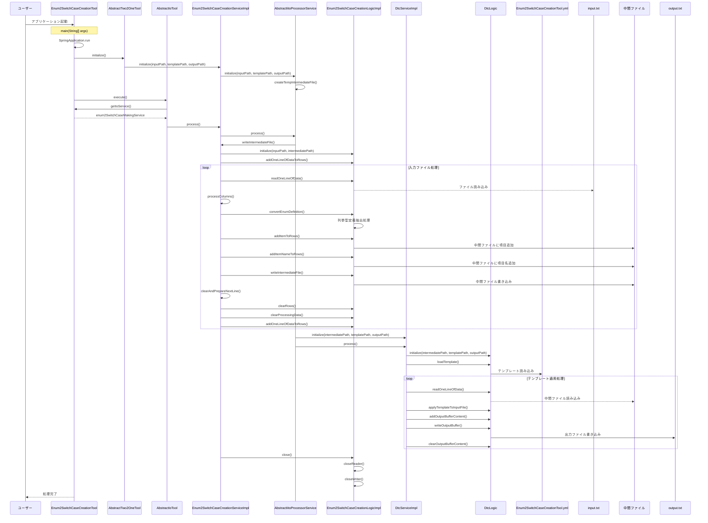

# 列挙型から case 文作成ツール設計書

## 1. クラス図

## 2. シーケンス図

## 3. テンプレートファイル構造

Enum2SwitchCaseCreationTool.yml は以下の構造を持っています：

1. **intermediatePlaceholders**: 中間ファイルから直接取得するプレースホルダー定義

   - displayName: 画面表示用の名称
   - replacementPattern: 置換対象のパターン

2. **derivedPlaceholders**: 中間ファイルから取得した値を変換して生成するプレースホルダー定義

   - displayName: 画面表示用の名称
   - replacementPattern: 置換対象のパターン
   - sourceKey: 変換元となる中間プレースホルダーの displayName
   - transformation: 適用する変換処理

3. **templateContent**: テンプレートの内容
   - {item}, {itemName}のプレースホルダーが実際の値に置換される

## 4. 処理フロー詳細

1. ユーザーがアプリケーションを起動
2. SpringBoot アプリケーションが起動し、Enum2SwitchCaseCreationTool のインスタンスが生成される
3. AbstractTwo2OneTool の initialize()メソッドが呼び出され、Enum2SwitchCaseCreationService が初期化される
4. AbstractIoTool の execute()メソッドが呼び出され、メイン処理が実行される
5. Enum2SwitchCaseCreationServiceImpl の writeIntermediateFile()メソッドが実行され、入力ファイルの処理が開始される
6. 入力ファイルから 1 行ずつデータを読み込み、以下の処理を行う：
   - 列挙型定義の抽出と変換
   - 列挙型の項目と項目名の抽出
   - 中間ファイル形式に変換して中間ファイルに書き込み
7. 中間ファイルの生成が完了したら、DtcService（テンプレートの動的変換サービス）を使用して：
   - テンプレートファイル（Enum2SwitchCaseCreationTool.yml）を読み込む
   - 中間ファイルのデータを読み込む
   - テンプレートにデータを適用して出力ファイルを生成する
8. リソースがクローズされ、処理が完了する

## 5. 主要コンポーネント

### Enum2SwitchCaseCreationTool

- SpringBootApplication として動作するエントリーポイント
- AbstractDtcTool を継承（さらに AbstractTwo2OneTool を継承）
- Enum2SwitchCaseCreationService を使用して switch-case 文生成を実行

### AbstractDtcTool

- AbstractTwo2OneTool を継承
- テンプレートの動的変換ツールの抽象クラス
- IitoProcessorService を返す抽象メソッドを定義

### AbstractTwo2OneTool

- AbstractIoTool を継承
- テンプレートファイルパスの管理と初期化処理を担当

### Enum2SwitchCaseCreationServiceImpl

- AbstractIitoProcessorService を継承
- Enum2SwitchCaseCreationService インターフェースを実装
- 入力ファイルの読み込みと中間ファイル形式への変換を担当

### Enum2SwitchCaseCreationLogicImpl

- switch-case 文作成の実際のロジックを担当
- 列挙型定義から switch-case 文に必要な情報を抽出
- 中間ファイル形式の中間ファイルを生成

### DtcService（テンプレートの動的変換サービス）

- テンプレートファイルと中間ファイルデータを使用して最終的な出力ファイルを生成
- プレースホルダの置換処理を担当

### テンプレートファイル（Enum2SwitchCaseCreationTool.yml）

- YAML フォーマットで定義されたテンプレート設定ファイル
- 以下の主要セクションで構成：
  - `intermediatePlaceholders`: 中間ファイルから直接取得するプレースホルダー定義
  - `derivedPlaceholders`: 中間ファイルから取得した値を変換して生成するプレースホルダー定義
  - `templateContent`: 実際のテンプレート内容

#### intermediatePlaceholders

- 中間ファイルの各列から直接マッピングされるプレースホルダー
  - `{item}`: 列挙型の項目名
  - `{itemName}`: 列挙型の表示名

#### derivedPlaceholders

- 既存のプレースホルダーから変換して生成される派生プレースホルダー
  - 必要に応じて定義される変換プレースホルダー

#### templateContent

- switch-case 文のテンプレートを定義
- 上記のプレースホルダーを使用して、列挙型の各項目に対応する case 文を生成
