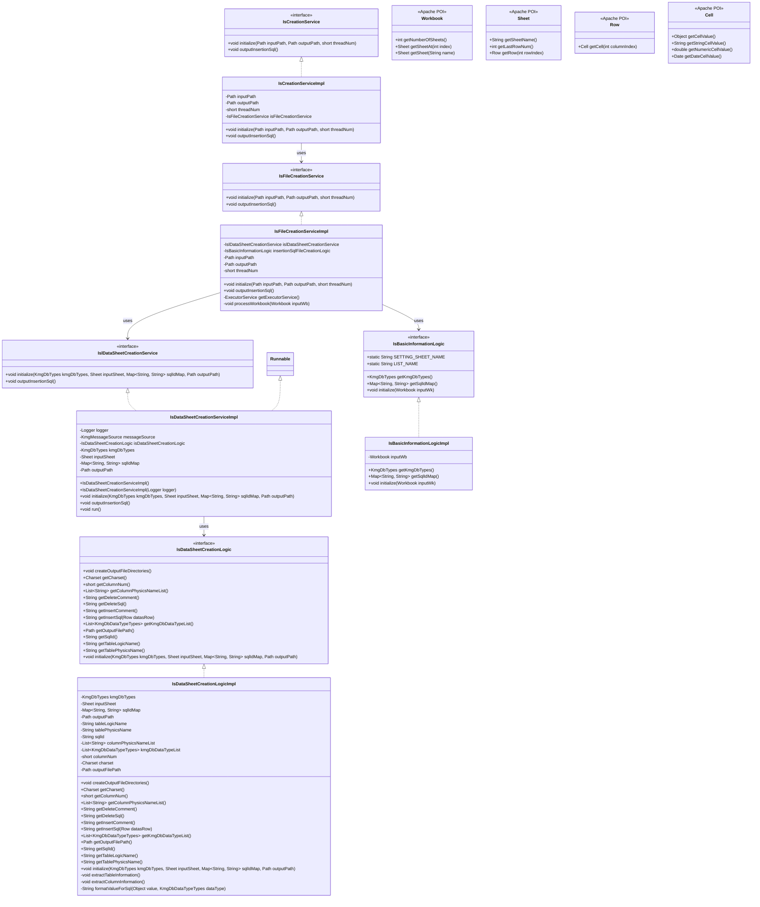
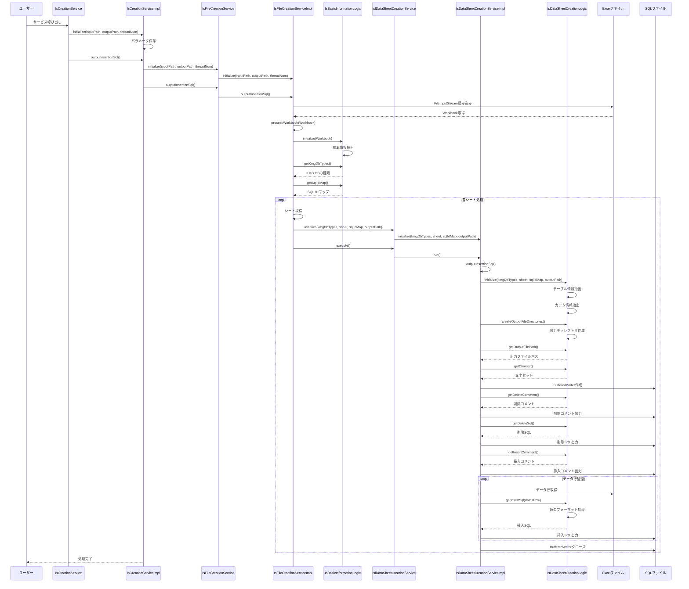

# 挿入 SQL 作成ツール設計書

## 1. クラス図

## 2. シーケンス図

## 3. 処理フロー詳細

1. **サービス初期化**

   - IsCreationService が初期化される
   - 入力パス、出力パス、スレッド数が設定される

2. **挿入 SQL 出力処理開始**

   - IsCreationService の outputInsertionSql() メソッドが呼び出される
   - IsFileCreationService が初期化される

3. **Excel ファイル処理**

   - Excel ファイル（Workbook）が読み込まれる
   - 基本情報ロジックが初期化され、設定情報から KMG DB の種類と SQL ID マップを取得

4. **シート別処理**

   - 各シートに対して並列処理が実行される（指定されたスレッド数で）
   - 設定シートと一覧シートはスキップされる
   - 各データシートに対して以下の処理が実行される：
     - テーブル情報（論理名、物理名、SQL ID）の抽出
     - カラム情報（物理名、データ型）の抽出
     - 出力ディレクトリの作成
     - SQL ファイルの生成

5. **SQL ファイル生成**

   - 各シートごとに SQL ファイルが生成される
   - 削除 SQL（DELETE 文）が先に出力される
   - 挿入 SQL（INSERT 文）がデータ行ごとに出力される
   - データ値は各カラムのデータ型に応じて適切にフォーマットされる

6. **処理完了**
   - 全シートの処理が完了
   - リソースが適切にクローズされる

## 4. 主要コンポーネント

### IsCreationService

- 挿入 SQL 作成のメインサービスインターフェース
- 初期化と挿入 SQL 出力の責任を持つ

### IsCreationServiceImpl

- IsCreationService の実装クラス
- IsFileCreationService への委譲を行う

### IsFileCreationService

- ファイルレベルの挿入 SQL 作成サービスインターフェース
- Excel ファイルの読み込みと処理の管理

### IsFileCreationServiceImpl

- IsFileCreationService の実装クラス
- Apache POI を使用して Excel ファイルを処理
- 並列処理（ExecutorService）によるシート別処理の管理

### IsBasicInformationLogic

- Excel ファイルの基本情報抽出ロジックインターフェース
- 設定シートから KMG DB の種類と SQL ID マップを取得

### IsBasicInformationLogicImpl

- IsBasicInformationLogic の実装クラス
- 設定シートの解析と基本情報の抽出

### IslDataSheetCreationService

- データシート別の挿入 SQL 作成サービスインターフェース
- Runnable インターフェースを実装し、並列処理に対応

### IsDataSheetCreationServiceImpl

- IslDataSheetCreationService の実装クラス
- 個別のデータシートに対する挿入 SQL 生成処理
- ファイル出力の管理

### IsDataSheetCreationLogic

- データシート作成の詳細ロジックインターフェース
- テーブル情報、カラム情報の抽出と SQL 生成

### IsDataSheetCreationLogicImpl

- IsDataSheetCreationLogic の実装クラス
- テーブル情報とカラム情報の詳細な抽出処理
- データ型に応じた値のフォーマット処理
- SQL 文の生成

## 5. 技術的特徴

### 並列処理

- ExecutorService を使用したマルチスレッド処理
- ユーザー指定のスレッド数での並列実行
- シート単位での独立した処理

### Excel 処理

- Apache POI を使用した Excel ファイルの読み込み
- 設定シートからの基本情報抽出
- データシートからのテーブル・カラム情報抽出

### エラーハンドリング

- KmgToolMsgException による統一された例外処理
- ログ出力による詳細なエラー情報の記録
- ユーザーフレンドリーなエラーメッセージ

## 6. 入力・出力仕様

### 入力

- **Excel ファイル**: 設定シートとデータシートを含むワークブック
- **設定シート**: KMG DB の種類と SQL ID マップの定義
- **データシート**: テーブル情報（論理名、物理名、SQL ID）とカラム情報（物理名、データ型）を含む

### 出力

- **SQL ファイル**: 各データシートに対応する挿入 SQL ファイル
- **削除 SQL**: テーブル内の全データを削除する DELETE 文
- **挿入 SQL**: データ行ごとの INSERT 文
- **コメント**: 各 SQL 文に対する説明コメント

### 設定項目

- **入力ファイルパス**: 処理対象の Excel ファイル
- **出力ディレクトリパス**: SQL ファイルの出力先
- **スレッド数**: 並列処理に使用するスレッド数（デフォルト：CPU 論理プロセッサ数）
